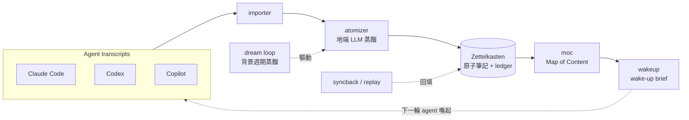

# paulshaclaw

> **一句話定位**：一套「個人 agent 作業系統（agent-OS）」的**架構參考 / 作品集 showcase** —— 不是可以 `pip install` 裝來就跑的產品，而是把「24×7 個人 AI agent 工作流」想清楚、並把其中最成熟的核心（**靠地端 LLM 蒸餾的記憶 pipeline**）開源展示的設計＋實作集。（對外品牌曾用 PaulShiaBro。）

---

## What it is / What it isn't

> 這段是全篇最重要的「期待值校準」。先說明**不要**期待什麼，能省下你的時間。

**這是什麼**

- 一個個人 agent 工作流的**設計 + 實作展示**：可讀程式碼、可讀設計文件（`openspec/` 與 `docs/`）、可跑測試（約 1198 passed）。
- 重點展示 **`transcript → 原子化 → Zettelkasten → MOC → wake-up brief`** 這條靠**地端 LLM** 蒸餾的記憶 pipeline（見下方「亮點」）。
- 一份關於「如何替個人 multi-agent 環境做治理（scope / autonomy / dispatch）」的**思路與骨架**（標 experimental / shadow，見下方「誠實狀態表」）。

**這不是什麼**

- ❌ **不是**裝起來就能用的成品 / SaaS / 套件。它**重度假設一套特定的個人環境**（見下方「Getting started / 環境前提」）。
- ❌ **不是**一鍵方案——外部依賴（地端 LLM、transcript 來源、tmux / WSL）需自備或自行替換。
- ❌ **不保證**跨環境可移植；它是為作者自己的工作流長出來的，公開是為了**參考價值**而非通用性。

> 本 repo 是作者個人系統的**完整快照**——含天天在跑的核心、library 級被動模組、以及尚未接進 runtime 的 experimental 治理骨架。各模組的真實狀態一律見下方「誠實狀態表」，不灌水。

---

## 亮點：記憶 pipeline（皇冠寶石）

> 整個專案最成熟、最值得讀的部分。

把多家 agent（Claude Code / Codex / Copilot 等）的對話 transcript，透過**地端 LLM** 蒸餾，逐步轉成可被下一輪 agent 喚起的長期記憶：

```
transcript → 原子化(atomize) → Zettelkasten 原子筆記 → MOC(Map of Content) → wake-up brief
                                  └── 由地端 LLM 蒸餾標題 / 摘要 ──┘
```



實作位於 [`paulshaclaw/memory/`](./paulshaclaw/memory/)（`importer / atomizer / moc / wakeup / dream / ledger / syncback / policy / routing` 等子模組）。

**為什麼值得看**：踩在「agent memory」這個熱題上，是端到端、有大量測試、天天在作者機器上跑的真實實作（非 demo）。實證：記憶層約 11k LOC、對應測試大量，knowledge 已累積數百則 slice。

---

## Getting started / 環境前提

> ⚠️ **先讀這段再 clone。** 本專案**死綁一套特定個人環境**；缺了下列前提，多數功能跑不起來。設計上已盡量把對個人 infra 的依賴抽成 **config / 可關閉開關**，但「自備或替換外部依賴」是使用前提。

**假設的環境**

| 前提 | 說明 | 缺了會怎樣 / 如何替換 |
|---|---|---|
| **WSL / Linux** | 開發與運行平台 | 其他平台未測試 |
| **tmux** | 多 pane / 多 agent 協作載體 | 無 tmux 則跨 pane 協作（cockpit）不可用 |
| **地端 LLM endpoint** | 記憶蒸餾後端（OpenAI / Anthropic 相容介面） | **必備**；無則 atomize / wake-up 不運作。endpoint 走 config，範例佔位 `http://127.0.0.1:8000`（請改成你自己的位址） |
| **transcript 來源格式** | 假設特定 agent CLI 的 transcript 落地格式 / 路徑 | 格式不符需自寫 adapter；路徑走 config |
| **狀態 / secret 路徑** | runtime 狀態與密鑰**放在 repo 外**（例：`~/.agents/`、`~/.config/paulshaclaw/`） | 路徑走 config；secret 不入庫（見下方「安全」） |

---

## Install

> 先確認上方「環境前提」；缺了地端 LLM endpoint 等前提，多數功能跑不起來。

```bash
# 1. 取得程式碼
git clone https://github.com/hamanpaul/paulshaclaw
cd paulshaclaw

# 2. 安裝相依（Python >= 3.10）
pip install -e .
#   個別 stage 另有 requirements-stage9.txt / requirements-stage11.txt

# 3. 設定環境前提（複製範例 config 後填入你自己的 endpoint / 路徑）
cp config/paulshaclaw-stage1.sample.json config/paulshaclaw-stage1.json
#   - 地端 LLM endpoint（OpenAI / Anthropic 相容）
#   - transcript 來源路徑
#   - 狀態 / secret 目錄（repo 外）

# 4. （建議）先只跑測試，確認核心是真的（見下方「測試 / 驗證」）
pytest tests/ paulshaclaw/memory/tests/
```

**安全 / 不入庫的東西**：密鑰、token、個人狀態一律放 repo 外（透過 config 指向 `~/.config/...`、`~/.agents/...`）。請勿把任何真實密鑰、內網主機名、客戶 / 專案代號寫進 repo。

---

## Usage

> 本專案重度綁環境（見「環境前提」）；公開重點是**讀**核心程式碼 / 設計 ＋ **跑測試**驗證核心為真，而非一鍵運行。

- 先跑測試確認核心為真（見下方「測試 / 驗證」）。
- 核心記憶 pipeline 的子模組與用法見 [`paulshaclaw/memory/`](./paulshaclaw/memory/)。
- 各模組「是否真的在 runtime 跑」一律見下方「誠實狀態表」。
- 設計與規格入口見 [`docs/`](./docs/)、[`openspec/`](./openspec/)。

---

## 誠實狀態表

> **戒灌水。** 下表據實標各模組完成度與**是否真的接進 runtime**。
>
> 圖例：✅ 在跑（wired + 天天運行）｜🟢 真實 library（有測試、被動呼叫）｜🧪 experimental / shadow（有測試、有份量，**但未接進 runtime**）｜🚧 未實作 / 空殼。

| 模組 | 角色 | 量（實證） | runtime 狀態 | 標記 |
|---|---|---|---|---|
| [`memory`](./paulshaclaw/memory/) | 記憶 pipeline + dream（皇冠寶石） | ~11k LOC | 端到端在跑 | ✅ |
| [`cost`](./paulshaclaw/cost/) | 多家 provider 用量 footer | ~1.8k LOC | 在跑 | ✅ |
| [`core`](./paulshaclaw/core/) | daemon + 路由核心 | ~1.1k LOC | 在跑 | ✅ |
| [`bot`](./paulshaclaw/bot/) | Telegram 主介面 | ~0.8k LOC | 在跑 | ✅ |
| [`monitor`](./paulshaclaw/monitor/) | 跨專案狀態同步 | ~1.4k LOC | 在跑 | ✅ |
| [`cockpit`](./paulshaclaw/cockpit/) | 實際的 TUI（多 session pane） | ~0.9k LOC | MVP 在跑 | ✅ |
| [`lifecycle`](./paulshaclaw/lifecycle/) | artifact / phase gate | ~0.4k LOC | library | 🟢 |
| [`observability`](./paulshaclaw/observability/) | health / recovery | ~0.2k LOC | library | 🟢 |
| [`security`](./paulshaclaw/security/) | redaction / approval / audit | ~0.3k LOC | library | 🟢 |
| [`deploy`](./paulshaclaw/deploy/) | install / upgrade / uninstall | ~0.3k LOC | library | 🟢 |
| [`persona`](./paulshaclaw/persona/) | scope / autonomy / config-loader 治理骨架 | ~0.76k LOC | **未接進 runtime** | 🧪 shadow |
| [`coordinator`](./paulshaclaw/coordinator/) | multi-agent dispatch / registry / seams | ~0.64k LOC | **未接進 runtime** | 🧪 shadow |
| [`tui`](./paulshaclaw/tui/) | 早期 TUI 嘗試 | **僅 ~19 LOC** | 基本沒做 | 🚧（真 TUI 見 `cockpit`） |

> ⚠️ **特別聲明（persona / coordinator）**：這兩塊有測試、有份量、踩 agent 治理熱題，**但目前尚未 wired 進任何運行路徑**（`core` / `bot` / `cockpit` 皆未 import）。本 repo 將其作為「**設計 + CLI 展示**」公開，標 **experimental / shadow**，**不宣稱「在跑」**。

---

## 測試 / 驗證

> 不必相信 README 自評——**自己跑測試**看核心是不是真的。

```bash
pytest tests/ paulshaclaw/memory/tests/
```

- 覆蓋現況（實證，2026-06-19）：**1198 passed / 1 skipped**（skipped 為需真實地端 LLM 的 opt-in live 測試）。
- CI：[`.github/workflows/tests.yml`](./.github/workflows/tests.yml) 會在 push / PR 跑 `pytest`。

---

## 設計文件

- 架構總覽：[`docs/research/`](./docs/research/)
- OpenSpec 規格與變更：[`openspec/`](./openspec/)
- 七大設計原則：Hub-and-spoke · Artifact-first · Proposal-first · Fail-close · Stage 獨立性 · 三軸分層 · always-on 失敗域分離

---

## Version

當前版本見 [`VERSION`](./VERSION)；變更紀錄見 [`CHANGELOG.md`](./CHANGELOG.md)。

---

## License

本專案採 **MIT License**（最簡、最寬鬆，適合 showcase）。完整條款見 [`LICENSE`](./LICENSE)；著作權人 `Copyright (c) 2026 Paul Chen (hamanpaul)`。

---

## English summary

**paulshaclaw** is a **reference / portfolio showcase** of a personal "agent operating system" — **not** a `pip install`-and-run product. It heavily assumes one specific personal environment (WSL, tmux, a local LLM endpoint, specific agent-CLI transcript formats). The crown jewel is a **memory pipeline** that distills multi-agent chat transcripts into long-term memory via a **local LLM** (`transcript → atomize → Zettelkasten → MOC → wake-up brief`). Other modules range from daily-driver runtime to passive libraries to **experimental, not-yet-wired** governance scaffolding (`persona` / `coordinator`) — each labeled honestly in the status table above. Run `pytest tests/ paulshaclaw/memory/tests/` to see the core is real (~1198 passing). MIT licensed.
