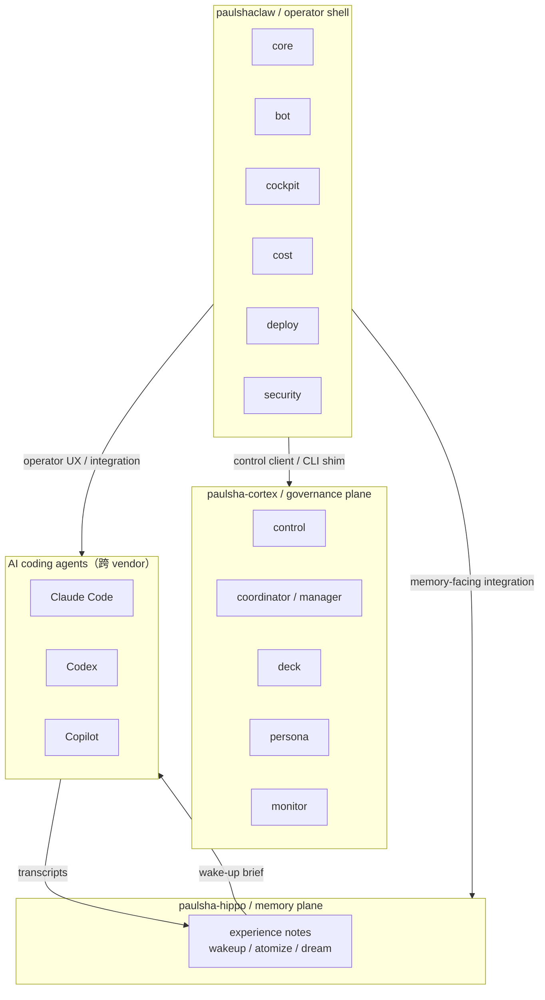

# paulshaclaw

> **一句話**：`paulshaclaw` 現在是個人 agent 作業系統的 **operator shell**——保留 shell / integration / operator-facing surface；**記憶平面**已遷至 [paulsha-hippo](https://github.com/hamanpaul/paulsha-hippo)，**manager / persona / control / deck / monitor 治理平面**已遷至 [paulsha-cortex](https://github.com/hamanpaul/paulsha-cortex)。（對外品牌 PaulShiaBro，吉祥物破蝦哥 🦞。）


*24 秒 demo。有聲高畫質版：[▶️ brag.mp4](./docs/media/brag.mp4)。*

這份 README 聚焦 **repo 定位**：哪些能力仍留在 `paulshaclaw`、哪些已拆到 `paulsha-hippo` / `paulsha-cortex`，以及 operator shell 如何把三者接成可操作的日常工作面。細節規格與研究文件見 [`docs/`](./docs/) 與 [`openspec/`](./openspec/)。

---

## 心智模型：operator shell 接三個平面



一句話關係：**`paulshaclaw` 是你每天碰到的 operator shell；`paulsha-hippo` 管記憶；`paulsha-cortex` 管治理與常駐服務。**

---

## 哪些東西住在哪裡

| 平面 | 現在的 repo | 角色 |
|---|---|---|
| 記憶平面 | [paulsha-hippo](https://github.com/hamanpaul/paulsha-hippo) | transcript importer、atomizer、MOC、wake-up、dream、memory policy / ledger |
| 治理平面 | [paulsha-cortex](https://github.com/hamanpaul/paulsha-cortex) | `control`、`coordinator`、`deck`、`persona`、`monitor`、systemd / daemon lifecycle |
| Operator shell | **本 repo `paulshaclaw`** | `core`、`bot`、`cockpit`、`cost`、`deploy`、`security`、shell 腳本、CLI shim、operator-facing integration |

### 已遷移，但本 repo 仍保留的接點

- **記憶平面**：本 repo 透過相依 pin 與 shell/integration 邊界對接 `paulsha-hippo`；`psc memory` 只保留 tombstone 指引。
- **治理平面**：本 repo 只允許碰 `paulsha_cortex.control.client` 與 `paulsha_cortex.cli`；`psc coordinator|deck|monitor` 會 lazy-import / shim 到 cortex CLI。
- **服務啟動**：[`scripts/start.sh`](./scripts/start.sh) 不再自帶 repo 內 manager 實作，改成委派 `python -m paulsha_cortex.cli install service`；若使用者環境沒有可用的 `systemctl --user`，才退回本地 fallback 啟動 cortex service entrypoints。

---

## 本 repo 目前聚焦什麼

| 模組 | 角色 |
|---|---|
| [`paulshaclaw/core/`](./paulshaclaw/core/) | 核心 daemon / command surface / control client glue |
| [`paulshaclaw/bot/`](./paulshaclaw/bot/) | Telegram operator 入口 |
| [`paulshaclaw/cockpit/`](./paulshaclaw/cockpit/) | TUI cockpit / pane orchestration UI |
| [`paulshaclaw/cost/`](./paulshaclaw/cost/) | provider usage / cost footer |
| [`paulshaclaw/deploy/`](./paulshaclaw/deploy/) | install / upgrade / uninstall planner |
| [`paulshaclaw/security/`](./paulshaclaw/security/) | operator-facing approval / redaction / audit helpers |
| [`paulshaclaw/observability/`](./paulshaclaw/observability/) | health / recovery baseline |
| [`scripts/`](./scripts/) | operator shell 啟動、hook、service glue |

> `monitor`、`coordinator`、`deck`、`persona`、`control` 已不再是本 repo 的實作子樹；README 不再把它們描述成仍位於 `./paulshaclaw/...` 下的可維護模組。

---

## 架構原則

- **hub-and-spoke**：單一治理平面（cortex）持有任務權威；operator shell 提供使用者介面與整合入口。
- **artifact-first / event-first**：prompt 文字不是最終真相；canonical state 落在 artifacts、event log、`~/.agents/` 契約檔案。
- **fail-close**：handoff、scope、import surface、記憶 ingestion 任一失真就關閉，不靠隱含慣例放行。
- **最小 import 面**：本 repo runtime 只保留 shell 需要的 `paulsha_cortex.control.client` / `paulsha_cortex.cli` 接點，避免治理平面重新滲回主 repo。

---

## 命名與路徑

**命名系統（勿改）**

- `paulshaclaw`：operator shell repo
- `paulsha-hippo`：記憶平面 repo
- `paulsha-cortex`：治理平面 repo
- `PaulShiaBro`：daemon / bot 對外品牌
- `psc`：CLI / env 短名
- `PoHsiaBro`：字型 / glyph 家族

**path split（三軸分層）**

- `paulshaclaw/`：本 repo code 與範本
- `~/.agents/`：私有 runtime 狀態；其中 `~/.agents/control`、`~/.agents/specs` 由 **paulsha-cortex** 消費，`~/.agents/memory` 由 **paulsha-hippo** 消費
- `~/.config/paulshaclaw/`：secret 與機器本地 config

**分階段生命週期（歷史脈絡）**

- Stage 1：`PaulShiaBro` daemon / bot / shell surfaces
- Stage 2：記憶基座已遷至 `paulsha-hippo`
- Stage 3：slash-command artifacts / gates
- Stage 4：persona / manager / control / deck / monitor 治理平面已遷至 `paulsha-cortex`
- Stage 5+：可觀測性、安全、部署加固

---

## Install

`paulshaclaw` 是 operator shell，記憶平面（`paulsha-hippo`）與治理平面（`paulsha-cortex`）是**外部依賴**。兩者皆已 public，`pip`/`pipx` 免認證即可安裝；版本由 `pyproject.toml` 的 git+SHA pin 鎖定。

### A. 全新安裝

```bash
# 1. 取得 operator shell
git clone https://github.com/hamanpaul/paulshaclaw
cd paulshaclaw

# 2. 裝本 repo（依 pyproject pin 自動拉下 paulsha-hippo + paulsha-cortex 作為 library）
pip install -e .
pytest tests/ -q            # 確認 operator shell 綠

# 3. 要跑常駐服務（記憶 + 治理），用 pipx 持久安裝兩個平面 CLI（勿用暫存 venv）
pipx install "git+https://github.com/hamanpaul/paulsha-hippo"
pipx install "git+https://github.com/hamanpaul/paulsha-cortex"
```

### B. 部署常駐服務

```bash
# 記憶平面：dream 蒸餾常駐 + agent host hooks（systemd 偵測 + fallback）
hippo init && hippo install hooks && hippo install service

# 治理平面：manager + monitor 一次帶（systemd --user）
cortex install service --instance cortex --repo-root "$PWD"
systemctl --user enable --now cortex-manager.timer cortex-monitor.service

hippo doctor          # 記憶側健檢
```

- **monitor 需要 project 設定**：`~/.agents/config/paulsha/project-cortex.yaml`（`workspaces: name/path`）；缺了 monitor 會以「無 project 設定」失敗。舊 `~/.config/paulshaclaw/paulshaclaw.yaml` 會被 legacy 讀取順序自動接上（帶 deprecation 警告）。可選再併 `project-hippo.yaml`（hippo 產生的 git/path registry）取 union。
- **服務啟動總管**：[`scripts/start.sh`](./scripts/start.sh) 委派 `cortex install service` / `enable --now`，systemd 不可用時退回前景 fallback。

### C. 既有機器：移植/更新到 operator shell 形態（cutover）

主 repo 已刪除 `persona/coordinator/control/deck/monitor` 五包，舊機器不能只 `git pull`——要把舊的 manager/monitor **cutover 到 cortex 服務**。一鍵腳本（冪等、systemd-aware、含 hippo）：

```bash
scripts/cutover-to-cortex.sh            # 預設對本 repo；或傳 <repo 路徑>
```

它會：`git pull main` → 依 pin 用 pipx 裝 hippo+cortex → hippo init/hooks/dream service → **停用舊 `paulshaclaw-manager`/`demo-manager` 單元** → `cortex install service` + enable → 確保 monitor 設定 → F1 自停 gate 健檢。runtime 狀態（`~/.agents/control`、`~/.agents/memory`）**零遷移**沿用。

**踩坑備忘**（cutover 實戰）：服務的 python 指向要**持久（pipx）**、勿用 `/tmp` venv；monitor 反覆失敗會被 systemd 限流，需 `systemctl --user reset-failed`；cortex pin 須含 F1 修正（manager 自停，見 cortex issue #2），否則 `cortex-manager.service` 會啟動即自停。

**安全 / 不入庫**：secret、token、個人狀態一律放 repo 外（`~/.config/...`、`~/.agents/...`）。請勿把任何真實密鑰、內網主機名、客戶 / 專案代號寫進 repo。

---

## Usage

- `psc coordinator ...` / `psc deck ...` / `psc monitor ...`：**shim 到 `paulsha-cortex` CLI**；若未安裝 cortex，會印出 tombstone 與安裝指引。
- `psc memory ...`：印出已遷移至 `paulsha-hippo` 的指引。
- [`scripts/start.sh`](./scripts/start.sh)：委派 cortex `install service` / `enable --now`，必要時退回本地 fallback；同時串起 bot、cost footer 與 cockpit 所需的 operator shell 行為。
- 讀設計時，先看本 README 的 repo 定位，再對照 [`docs/`](./docs/)、[`openspec/`](./openspec/) 與兩個外部 plane repo。

---

## 遷移備忘

- **#125 起**：記憶 pipeline 實作移至 `paulsha-hippo`；本 repo 保留整合與 pin。
- **本次 cortex cutover 後**：`manager / persona / control / deck / monitor` 實作移至 `paulsha-cortex`；本 repo 保留 shell-facing consumer 與 CLI shim。
- README 若提到 Stage 4，請視為**治理平面歷史脈絡**，而非「這些模組仍在本 repo」。

---

## 設計文件

- 架構總覽：[`docs/research/05.paulshaclaw-overview-architecture-stages-dependencies-acceptance.md`](./docs/research/05.paulshaclaw-overview-architecture-stages-dependencies-acceptance.md)
- Stage 3 生命週期 / slash-command / gate：[`docs/research/03.stage3-lifecycle-slash-commands-artifacts-phase-gating-research.md`](./docs/research/03.stage3-lifecycle-slash-commands-artifacts-phase-gating-research.md)
- Stage 4 persona / handoff / guardrail 研究脈絡（現為 cortex 治理平面歷史來源）：[`docs/research/04.stage4-persona-role-catalog-handoff-guardrails-research.md`](./docs/research/04.stage4-persona-role-catalog-handoff-guardrails-research.md)
- 記憶路由：[`paulsha-hippo/routing.md`](https://github.com/hamanpaul/paulsha-hippo/blob/main/paulsha_hippo/routing.md)
- 規格與變更：[`openspec/`](./openspec/)

---

## Version

當前版本見 [`VERSION`](./VERSION)；變更紀錄見 [`CHANGELOG.md`](./CHANGELOG.md)。

---

## License

MIT License，著作權人 `Copyright (c) 2026 Paul Chen (hamanpaul)`。完整條款見 [`LICENSE`](./LICENSE)。

---

## English summary

**paulshaclaw** is now the **operator shell** for a personal agent OS. The repository keeps shell / integration / operator-facing surfaces such as `core`, `bot`, `cockpit`, `cost`, `deploy`, and `security`, while two major planes live elsewhere:

- **Memory plane** → [paulsha-hippo](https://github.com/hamanpaul/paulsha-hippo)
- **Governance plane** (`coordinator`, `control`, `deck`, `persona`, `monitor`) → [paulsha-cortex](https://github.com/hamanpaul/paulsha-cortex)

`psc coordinator|deck|monitor` are shimmed to the cortex CLI, and `scripts/start.sh` delegates cortex service installation/startup before wiring the local operator shell surfaces together.
