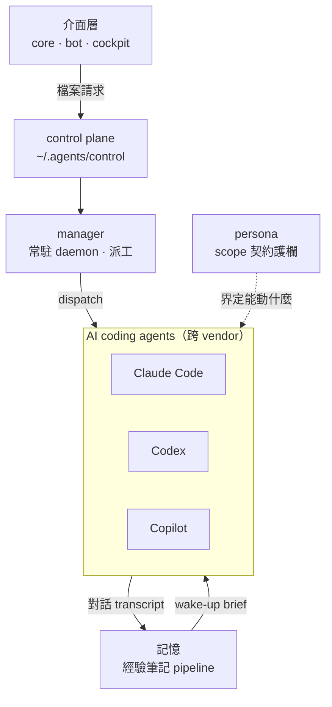
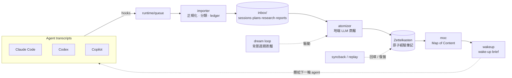

# paulshaclaw

> **一句話**：一套個人「agent 作業系統」——把 **記憶**、**manager**、**persona** 三件事組成一層底座，圍繞著你日常在用的 AI coding agent（Claude Code / Codex / Copilot），讓它們**跨 session、跨 vendor 記得住、也管得住**。（對外品牌 PaulShiaBro，吉祥物破蝦哥 🦞。）


*24 秒 demo（三大支柱）。有聲高畫質版：[▶️ brag.mp4](./docs/media/brag.mp4)。*

這份 README 講的是**架構與設計**：系統由哪些部分組成、彼此怎麼搭、資料與控制怎麼流動。實作與規格細節見各模組原始碼與 [`docs/`](./docs/)、[`openspec/`](./openspec/)。

---

## 心智模型：三大支柱環繞 agent

單一個 AI coding agent 有兩個先天缺口：**關掉就失憶**（每個 session 從零開始）、**放它自己跑很危險**（沒有邊界與排程）。paulshaclaw 用三根支柱把這兩個缺口補起來，全部圍繞著 agent：

- **記憶（memory）** — 把 agent 的對話 transcript 用**地端 LLM** 蒸餾成可複用的**經驗筆記**（教訓 / 偏好 / 踩過的坑），隔天以 *wake-up brief* 餵回下一個 agent。跨 vendor 通用。
- **manager（coordinator + control）** — 一個常駐 daemon，把「相依已就緒」的任務切片自動派給 agent（tmux pane + 獨立 git worktree），並用檔案契約控制面對外暴露。
- **persona** — 每個 agent 角色的**契約護欄**：能在哪個生命週期階段動、能寫哪些路徑、能用哪些工具。



一句話關係：**manager 決定「誰、何時、跑什麼」；persona 決定「這個誰、被允許動什麼」；記憶餵給它「昨天學到什麼」。**

---

## 架構原則

- **hub-and-spoke**：單一 manager / orchestrator 持有任務權威；worker（agent）做有界執行並回傳 artifact。除非文件明示，避免 worker↔worker mesh。
- **artifact-first / event-first**：prompt 文字**不是**真相源；canonical state 落在 artifacts 與 event log，gate 決策依檔案 / schema / 事件記錄。
- **fail-close**：信任邊界（handoff 讀取、scope 檢查、記憶 ingestion）出錯時一律關閉、不放行。
- **stage 獨立性 / 三軸分層 / always-on 失敗域分離**：模組沿分階段生命週期演進（見下方「命名與路徑」），各 stage 可獨立驗證；always-on 服務與一次性任務的失敗域分開。

---

## 支柱一：記憶（經驗筆記 pipeline）

整個系統最成熟、天天在作者機器上跑的部分。它**不是**專案待辦或狀態記憶，而是把多家 agent 的對話蒸餾成**可複用的經驗筆記**（Zettelkasten 原子筆記），跨專案、跨 vendor 沿用。



**資料流（deterministic pipeline，見 [`memory/routing.md`](./paulshaclaw/memory/routing.md)）**

| 階段 | 子模組 | 做什麼 |
|---|---|---|
| 收件 | `hooks` + `importer` | hook 把各家 session payload 寫進 `runtime/queue`；importer 做 adapter 正規化、frontmatter/render、project resolver、classifier、idempotent ledger，路由到 `inbox/` |
| 蒸餾 | `atomizer` | 用地端 LLM 把 artifact 拆解、連結成原子筆記（deterministic splitting + linking） |
| 組織 | `moc` | 把原子筆記織成 Map of Content（知識地圖） |
| 喚起 | `wakeup` | 產出 *wake-up brief*，讓下一個 agent 一開機就載入昨日經驗 |
| 背景 | `dream` | 常駐的週期蒸餾迴圈，持續把新 transcript 煉成筆記 |
| 治理 | `policy` · `ledger` · `syncback` · `replay` | 記憶安全政策（redaction / classification / audit）、事件 ledger 與完整性、回填與復盤 |

輔以 `retrieval`（取用）、`retitle` / `rekey`（重寫標題 / 主鍵）、`noise`（去噪）、`usage`（用量）、`skillopt`、`lint` 等。實作見 [`paulshaclaw/memory/`](./paulshaclaw/memory/)。

**設計重點**：地端 LLM 蒸餾（隱私留在本機）、跨 vendor 統一格式（adapter 正規化）、idempotent ledger（可重跑不重複）、fail-close 的 ingestion 安全契約。

---

## 支柱二：manager（編排執行面）

把「多個 agent 一起工作」變成可控的常駐服務。分兩塊：

**[`coordinator/`](./paulshaclaw/coordinator/) — 引擎**
- `manager_daemon`：常駐 daemon + **tick 迴圈**（預設 300s tick / 3s poll），每 tick 派發就緒工作並回收孤兒 broker。
- `autonomy`（`dispatch_ready`）：**相依滿足才放行下游**——只派發依賴已 merged / handoff gate 過關的 slice。
- `dispatcher` + `seams`：透過 seam（`PaneSender` / `WorktreeCreator`）把命令送進 **tmux pane**、在**獨立 git worktree** 執行。
- `manager`：任務狀態機（`dispatched` / `running` → `done` / `failed`）。

**[`control/`](./paulshaclaw/control/) — 檔案契約控制面**
- 介面層（core / bot / cockpit）**不直接 import coordinator**，改在 `~/.agents/control/` 用檔案溝通：`requests/`（type：`tick` / `fanout`）、`done/`、`status.json`、`manager.lock`。
- `atomic_write_json`（temp + `rename`）＝ crash-safe 原子寫；`status.json` 帶健康語意（無 live pid → stale、卡死 → degraded，live-but-busy 不算 degraded）。

現況：manager daemon 與 control plane 已接進運行路徑（[`scripts/start.sh`](./scripts/start.sh) 拉起的 resident daemon）。

---

## 支柱三：persona（治理契約面）

回答「這個 agent 角色，**被允許**動什麼」。核心是：**persona = 契約**，agent instance 才是 runtime 執行，skill 是可復用能力。實作見 [`paulshaclaw/persona/`](./paulshaclaw/persona/)。

- `contract`（[`personas.yaml`](./paulshaclaw/persona/personas.yaml)）：每個角色宣告 `allowed_phases`（能在哪些生命週期階段）、`write_paths`（能寫哪些路徑）、`allowed_tools`（工具白名單）。內建三角色：
  - **manager**：orchestrate / dispatch / policy / commit / push / PR / merge
  - **builder**：只在 `build` 階段、只寫 `paulshaclaw/**`、`tests/**`
  - **reviewer**：只在 `review`、只寫 `reports/review/**`、**不改 code**
- `guardrail`：對每個動作回 `GuardrailDecision(allowed, rule_id, reason)`——越界寫入就擋。
- `scope_ci` / `gate`：CI 側把 PR 的 `git diff` 變動路徑比對契約，**fail-close**。
- `handoff`：角色間交棒用 JSON manifest，寫端不驗、**讀端是 fail-close 信任邊界**。

現況：enforcement 目前為 `shadow`（觀察模式，算出違規但不擋），設計上可切換為 enforcing 並接進 dispatch 路徑。

---

## 介面層與橫切能力

**介面層（都只碰 `control` client，不直接 import coordinator）**

| 模組 | 角色 |
|---|---|
| [`core`](./paulshaclaw/core/) | 核心 daemon + 路由 |
| [`bot`](./paulshaclaw/bot/) | Telegram 主介面 |
| [`cockpit`](./paulshaclaw/cockpit/) | TUI（多 session pane），破蝦哥座艙 |

**橫切能力（cross-cutting）**

| 模組 | 角色 |
|---|---|
| [`cost`](./paulshaclaw/cost/) | 多家 provider 用量 / 成本 footer |
| [`monitor`](./paulshaclaw/monitor/) | 跨專案狀態同步 |
| [`lifecycle`](./paulshaclaw/lifecycle/) | artifact / phase gate |
| [`observability`](./paulshaclaw/observability/) | health / recovery |
| [`security`](./paulshaclaw/security/) | redaction / approval / audit |
| [`deploy`](./paulshaclaw/deploy/) | install / upgrade / uninstall |

> 各模組成熟度不一：記憶 pipeline 端到端在跑、manager 控制面在跑；`persona` 護欄目前為 shadow 觀察模式；早期的 [`tui`](./paulshaclaw/tui/) 已由 `cockpit` 取代。細節見各模組原始碼。

---

## 命名與路徑

**命名系統（勿改）**

- `paulshaclaw`：repo｜`PaulShiaBro`：daemon / bot｜`psc`：CLI / env 短名｜`PoHsiaBro`：字型 / glyph 家族｜破蝦哥：吉祥物

**path split（三軸分層）**

- `paulshaclaw/`：repo code 與範本
- `~/.agents/`：私有 runtime 狀態與記憶（含 `control/`）
- `~/.config/paulshaclaw/`：secret 與機器本地 config

**分階段生命週期**：模組名常帶 stage 標記（如 `core` 為 Stage 1、`memory` 為 Stage 2、`persona`/`coordinator` 為 Stage 4）——這是歷史演進脈絡，非完成度評分。

---

## 環境前提

> ⚠️ 本專案**重度假設一套特定個人環境**，設計上已盡量把對個人 infra 的依賴抽成 config / 可關閉開關，但「自備或替換外部依賴」是使用前提。

| 前提 | 說明 | 缺了會怎樣 |
|---|---|---|
| **WSL / Linux** | 開發與運行平台 | 其他平台未測試 |
| **tmux** | 多 pane / 多 agent 協作載體 | 無 tmux 則跨 pane 協作（cockpit / dispatch）不可用 |
| **地端 LLM endpoint** | 記憶蒸餾後端（OpenAI / Anthropic 相容介面） | **必備**；無則 atomize / wake-up 不運作。走 config，範例佔位 `http://127.0.0.1:8000`（請改成你自己的位址） |
| **transcript 來源格式** | 假設特定 agent CLI 的 transcript 落地格式 / 路徑 | 格式不符需自寫 adapter；路徑走 config |
| **狀態 / secret 路徑** | runtime 狀態與密鑰放在 repo 外（`~/.agents/`、`~/.config/paulshaclaw/`） | 路徑走 config；secret 不入庫 |

---

## Install

```bash
# 1. 取得程式碼
git clone https://github.com/hamanpaul/paulshaclaw
cd paulshaclaw

# 2. 安裝相依（Python >= 3.10）
pip install -e .

# 3. 設定環境前提（複製範例 config 後填入你自己的 endpoint / 路徑）
cp config/paulshaclaw-stage1.sample.json config/paulshaclaw-stage1.json
#   - 地端 LLM endpoint（OpenAI / Anthropic 相容）
#   - transcript 來源路徑
#   - 狀態 / secret 目錄（repo 外）

# 4. 跑測試確認核心
pytest tests/ paulshaclaw/memory/tests/
```

**安全 / 不入庫**：密鑰、token、個人狀態一律放 repo 外（透過 config 指向 `~/.config/...`、`~/.agents/...`）。請勿把任何真實密鑰、內網主機名、客戶 / 專案代號寫進 repo。CI（[`.github/workflows/tests.yml`](./.github/workflows/tests.yml)）會在 push / PR 跑測試。

---

## Usage

本專案重度綁一套特定個人環境（見「環境前提」）；公開的價值在於**讀架構 / 設計**與**跑測試**，而非一鍵運行。

- 從上方「心智模型」與三大支柱讀起，對照各模組原始碼。
- 記憶 pipeline 的子模組與資料流見 [`paulshaclaw/memory/`](./paulshaclaw/memory/) 與 [`paulshaclaw/memory/routing.md`](./paulshaclaw/memory/routing.md)。
- manager 由 [`scripts/start.sh`](./scripts/start.sh) 拉起；介面層（core / bot / cockpit）透過 `~/.agents/control/` 檔案契約驅動它。
- 設計與規格入口見 [`docs/`](./docs/)、[`openspec/`](./openspec/)。

---

## 設計文件

- 架構總覽：[`docs/research/05.paulshaclaw-overview-architecture-stages-dependencies-acceptance.md`](./docs/research/05.paulshaclaw-overview-architecture-stages-dependencies-acceptance.md)
- Stage 3 生命週期 / slash-command / gate：[`docs/research/03...`](./docs/research/03.stage3-lifecycle-slash-commands-artifacts-phase-gating-research.md)
- Stage 4 persona 契約 / handoff / 護欄：[`docs/research/04...`](./docs/research/04.stage4-persona-role-catalog-handoff-guardrails-research.md)
- 記憶路由：[`paulshaclaw/memory/routing.md`](./paulshaclaw/memory/routing.md)
- 規格與變更：[`openspec/`](./openspec/)

---

## Version

當前版本見 [`VERSION`](./VERSION)；變更紀錄見 [`CHANGELOG.md`](./CHANGELOG.md)。

---

## License

MIT License，著作權人 `Copyright (c) 2026 Paul Chen (hamanpaul)`。完整條款見 [`LICENSE`](./LICENSE)。

---

## English summary

**paulshaclaw** is a personal "agent OS" — a substrate of **three pillars around your everyday AI coding agents** (Claude Code / Codex / Copilot):

- **memory** — distills agent transcripts into reusable **experience notes** via a **local LLM** (`transcript → atomize → Zettelkasten → MOC → wake-up brief`), fed back to the next agent; cross-vendor.
- **manager** (`coordinator` + `control`) — a resident daemon that dispatches dependency-ready task slices to agents in tmux panes + isolated git worktrees, exposed via a crash-safe file-contract control plane under `~/.agents/control`.
- **persona** — per-role contracts (allowed phases / write-paths / tools) enforced by a guardrail, CI scope-checked against the diff (currently in shadow mode).

Design is **hub-and-spoke** and **artifact / event-first**: canonical state lives in artifacts and event logs, not prompt text. The project heavily assumes one specific personal environment (WSL, tmux, a local LLM endpoint, specific agent-CLI transcript formats). MIT licensed.
