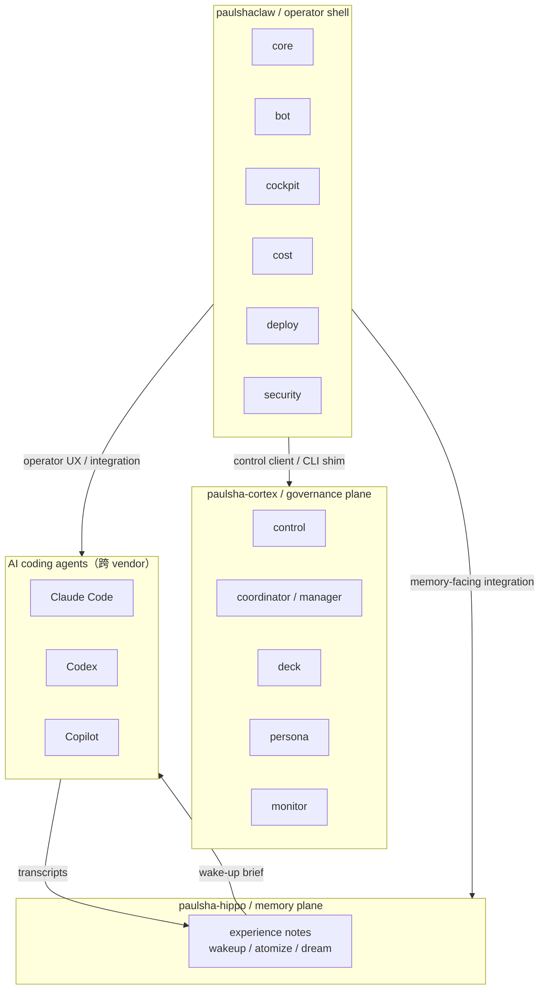

> **Fact:** `paulshaclaw` 是整套系統的人類操作與產品入口；它整合 operator-facing surfaces，但不擁有 workflow lifecycle、domain verdict 或 long-term experience authority。

# paulshaclaw

> **一句話**：`paulshaclaw` 現在是個人 agent 作業系統的 **operator shell**——保留 shell / integration / operator-facing surface；**記憶平面**已遷至 [paulsha-hippo](https://github.com/hamanpaul/paulsha-hippo)，**manager / persona / control / deck / monitor 治理平面**已遷至 [paulsha-cortex](https://github.com/hamanpaul/paulsha-cortex)。（對外品牌 PaulShiaBro，吉祥物破蝦哥 🦞。）


*24 秒 demo。有聲高畫質版：[▶️ brag.mp4](./docs/media/brag.mp4)。*

這份 README 聚焦 **repo 定位**：哪些能力仍留在 `paulshaclaw`、哪些已拆到 `paulsha-hippo` / `paulsha-cortex`，以及 operator shell 如何把三者接成可操作的日常工作面。細節規格與研究文件見 [`docs/`](./docs/) 與 [`openspec/`](./openspec/)。

---

## 心智模型：operator shell 接三個平面


```mermaid
flowchart TB
    subgraph vendors[AI coding agents（跨 vendor）]
        CC[Claude Code]
        CX[Codex]
        CP[Copilot]
    end

    subgraph shell[paulshaclaw / operator shell]
        CORE[core]
        BOT[bot]
        COCKPIT[cockpit]
        COST[cost]
        DEPLOY[deploy]
        SECURITY[security]
    end

    subgraph hippo[paulsha-hippo / memory plane]
        MEM[experience notes\nwakeup / atomize / dream]
    end

    subgraph cortex[paulsha-cortex / governance plane]
        CTRL[control]
        MGR[coordinator / manager]
        DECK[deck]
        PERSONA[persona]
        MON[monitor]
    end

    vendors -->|transcripts| MEM
    MEM -->|wake-up brief| vendors
    shell -->|operator UX / integration| vendors
    shell -->|control client / CLI shim| cortex
    shell -->|memory-facing integration| hippo
```

一句話關係：**`paulshaclaw` 是你每天碰到的 operator shell；`paulsha-hippo` 管記憶；`paulsha-cortex` 管治理與常駐服務。**

---

## 哪些東西住在哪裡

| 平面 | 現在的 repo | 角色 |
|---|---|---|
| 記憶平面 | [paulsha-hippo](https://github.com/hamanpaul/paulsha-hippo) | transcript importer、atomizer、MOC、wake-up、dream、memory policy / ledger |
| 治理平面 | [paulsha-cortex](https://github.com/hamanpaul/paulsha-cortex) | `control`、`coordinator`、`deck`、`persona`、`monitor`、systemd / daemon lifecycle |
| Operator shell | **本 repo `paulshaclaw`** | `core`、`bot`、`cockpit`、`cost`、`deploy`、`security`、shell 腳本、CLI shim、operator-facing integration |

### 已遷移，但本 repo 仍保留的接點

- **記憶平面**：本 repo 透過相依 pin 與 shell/integration 邊界對接 `paulsha-hippo`；`psc memory` 只保留 tombstone 指引。
- **治理平面**：本 repo 只允許碰 `paulsha_cortex.control.client` 與 `paulsha_cortex.cli`；`psc coordinator|deck|monitor` 會 lazy-import / shim 到 cortex CLI。
- **服務啟動**：[`scripts/start.sh`](./scripts/start.sh) 不再自帶 repo 內 manager 實作，改成委派 `python -m paulsha_cortex.cli install service`；若使用者環境沒有可用的 `systemctl --user`，才退回本地 fallback 啟動 cortex service entrypoints。

---

## 本 repo 目前聚焦什麼

| 模組 | 角色 |
|---|---|
| [`paulshaclaw/core/`](./paulshaclaw/core/) | 核心 daemon / command surface / control client glue |
| [`paulshaclaw/bot/`](./paulshaclaw/bot/) | Telegram operator 入口 |
| [`paulshaclaw/cockpit/`](./paulshaclaw/cockpit/) | TUI cockpit / pane orchestration UI |
| [`paulshaclaw/cost/`](./paulshaclaw/cost/) | provider usage / cost footer |
| [`paulshaclaw/deploy/`](./paulshaclaw/deploy/) | install / upgrade / uninstall planner |
| [`paulshaclaw/security/`](./paulshaclaw/security/) | operator-facing approval / redaction / audit helpers |
| [`paulshaclaw/observability/`](./paulshaclaw/observability/) | health / recovery baseline |
| [`scripts/`](./scripts/) | operator shell 啟動、hook、service glue |

> `monitor`、`coordinator`、`deck`、`persona`、`control` 已不再是本 repo 的實作子樹；README 不再把它們描述成仍位於 `./paulshaclaw/...` 下的可維護模組。

---

## 架構原則

- **hub-and-spoke**：單一治理平面（cortex）持有任務權威；operator shell 提供使用者介面與整合入口。
- **artifact-first / event-first**：prompt 文字不是最終真相；canonical state 落在 artifacts、event log、`~/.agents/` 契約檔案。
- **fail-close**：handoff、scope、import surface、記憶 ingestion 任一失真就關閉，不靠隱含慣例放行。
- **最小 import 面**：本 repo runtime 只保留 shell 需要的 `paulsha_cortex.control.client` / `paulsha_cortex.cli` 接點，避免治理平面重新滲回主 repo。

---

## 命名與路徑

**命名系統（勿改）**

- `paulshaclaw`：operator shell repo
- `paulsha-hippo`：記憶平面 repo
- `paulsha-cortex`：治理平面 repo
- `PaulShiaBro`：daemon / bot 對外品牌
- `psc`：CLI / env 短名
- `PoHsiaBro`：字型 / glyph 家族

**path split（三軸分層）**

- `paulshaclaw/`：本 repo code 與範本
- `~/.agents/`：私有 runtime 狀態；其中 `~/.agents/control`、`~/.agents/specs` 由 **paulsha-cortex** 消費，`~/.agents/memory` 由 **paulsha-hippo** 消費
- `~/.config/paulshaclaw/`：secret 與機器本地 config

**分階段生命週期（歷史脈絡）**

- Stage 1：`PaulShiaBro` daemon / bot / shell surfaces
- Stage 2：記憶基座已遷至 `paulsha-hippo`
- Stage 3：slash-command artifacts / gates
- Stage 4：persona / manager / control / deck / monitor 治理平面已遷至 `paulsha-cortex`
- Stage 5+：可觀測性、安全、部署加固

---

## Install

`paulshaclaw` 是 operator shell，記憶平面（`paulsha-hippo`）與治理平面（`paulsha-cortex`）是**外部依賴**。兩者皆已 public，`pip`/`pipx` 免認證即可安裝；版本由 `pyproject.toml` 的 git+SHA pin 鎖定。

安裝分成兩種情境，請依身分選：

- **End-user 生產安裝**：從 GitHub Release 下載 wheel 安裝，不 clone repo（見 §A）。
- **Developer 開發安裝**：clone repo 後 editable install，含可跑測試的完整 runtime（見 §B）。

完整 release 契約（版本來源一致性、前置 gate、失敗重跑、撤回規則、distribution strategy 裁決）見 [`docs/release-contract.md`](./docs/release-contract.md)。

### A. 從 release artifact 安裝（end-user 生產安裝）

正式版本以 GitHub Release artifact 為 distribution authority（裁決見 release-contract §5）。
從對應 `vX.Y.Z` Release 下載 wheel（含 SHA-256 checksums 驗證），在專用 venv 安裝：

```bash
# 1. 建立 end-user venv（不要用系統 Python，PEP 668）
python3 -m venv ~/.venv-paulshaclaw
~/.venv-paulshaclaw/bin/python -m pip install --upgrade pip

# 2. 從 vX.Y.Z Release 下載 wheel 與 checksums
#    https://github.com/hamanpaul/paulshaclaw/releases
#    下載 paulshaclaw-X.Y.Z-py3-none-any.whl 與 checksums-sha256.txt

# 3. 驗證 checksum
sha256sum -c checksums-sha256.txt --ignore-missing

# 4. 從 wheel 安裝（會依 pyproject 的 git+SHA pin 自動拉 hippo/cortex）
~/.venv-paulshaclaw/bin/python -m pip install paulshaclaw-X.Y.Z-py3-none-any.whl

# 5. 確認（psc 是 dispatcher，無參數會印 usage 並以 exit 2 結束，這是正常行為）
~/.venv-paulshaclaw/bin/psc
~/.venv-paulshaclaw/bin/python -m pip show paulshaclaw   # 顯示版本與來源
```

> **為何不是 PyPI**：`paulsha-hippo` / `paulsha-cortex` 是 `git+<url>@<SHA>` direct reference，PyPI 上傳政策不接受 direct URL 參照，故第一階段僅以 GitHub Release 分發。詳見 release-contract §5 的實測依據。

**建議改用 pipx**（指令直接進 PATH，不必進 venv）：

```bash
pipx install paulshaclaw-X.Y.Z-py3-none-any.whl   # 之後任何目錄直接打 paulshaclaw / psc
pipx upgrade paulshaclaw                            # 升級改裝新 wheel 時：pipx install --force <新 wheel>
```

pipx 會自建隔離 venv 並把 `paulshaclaw`／`psc` 露出到 `~/.local/bin`，與上面手動 venv 流程等價；兩者擇一即可。

#### 正式啟動（`paulshaclaw` 指令，#288）

裝好 wheel 後，operator shell 的**正式啟動路徑**是 `paulshaclaw` console script——不需要 clone repo：

```bash
# tmux 內啟動（含 cockpit TUI）
~/.venv-paulshaclaw/bin/paulshaclaw

# 無 tmux 的機器：不起 cockpit、常駐前景
~/.venv-paulshaclaw/bin/paulshaclaw --no-cockpit  # 等同 `paulshaclaw up --no-cockpit`

# 停掉現任 operator shell（不啟動新的）／查狀態
~/.venv-paulshaclaw/bin/paulshaclaw down
~/.venv-paulshaclaw/bin/paulshaclaw status
```

兩條啟動路徑職責分離（詳見 [release-contract §9](./docs/release-contract.md)）：

| 路徑 | 定位 | 來源 | 版本 |
|---|---|---|---|
| `scripts/start.sh` | 開發驗證 | repo checkout | 跟著工作樹，隨時可變 |
| `paulshaclaw` | 正式啟動 | 已安裝的 release artifact | 只 pin 該 release 的版本 |

- **二擇一、後起的為主**：兩者共用同一把 start lock，新啟動的那套會先停掉既有的（process 持有者送 SIGTERM、systemd 持有者走 `systemctl --user stop`），**停不掉即 fail-closed** 明確報告、絕不兩套並存。接管邊界僅及操作面自身行程與 units，不波及 cortex / hippo 常駐服務。
- 與 `psc` 的區隔：`psc` 是轉發 coordinator/deck/monitor 給 cortex 的 **dispatcher**，`paulshaclaw` 是 operator shell 的**啟動入口**，語意不同、不要混用。
- **僅 `paulshaclaw` 指令（release 路徑）**：cortex fallback 起不來時（#346）cockpit 仍會照常啟動，並在 stderr 印出 degraded 警告與對應 log 路徑，不再 fail-closed 擋下整個啟動；`scripts/start.sh`（開發路徑）未變，fallback 起不來仍會 fail-closed 直接退出。

### B. 開發安裝（clone + editable install）

```bash
# 1. 取得 operator shell
git clone https://github.com/hamanpaul/paulshaclaw
cd paulshaclaw

# 2. 建立 repo 專用 venv，並依 pyproject 強制刷新完整 operator runtime
python3 -m venv .venv
.venv/bin/python -m pip install --upgrade --force-reinstall -e .
.venv/bin/python -m pip install pytest build
.venv/bin/python -m pytest tests/ -q  # 確認同一 operator runtime 綠
./scripts/preflight-tests.sh  # preflight 同樣使用 repo operator runtime

# 3. 要跑常駐服務（記憶 + 治理），用 pipx 持久安裝兩個平面 CLI（勿用暫存 venv）
pipx install "git+https://github.com/hamanpaul/paulsha-hippo"
pipx install "git+https://github.com/hamanpaul/paulsha-cortex"
```

Ubuntu 24.04 / Debian 的系統 Python 受 PEP 668 管理，請勿用 `pip install --user -e .` 繞過；上面的 repo `.venv` 流程可直接重跑以刷新 pin。pipx 的 plane CLI 位於各自的隔離 venv，只有當 `cortex` shebang 指向的 Python 同時可 import `paulsha_cortex` 與 `textual` 時，`scripts/start.sh` 才會把它當成 operator runtime；一般情況仍以 repo `.venv` 為準。

### C. 部署常駐服務

```bash
# 記憶平面：dream 蒸餾常駐 + agent host hooks（systemd 偵測 + fallback）
hippo init && hippo install hooks && hippo install service

# 治理平面：manager + monitor 一次帶（systemd --user）
cortex install service --instance cortex --repo-root "$PWD"
systemctl --user enable --now cortex-manager.timer cortex-monitor.service

hippo doctor          # 記憶側健檢
```

- **monitor 需要 project 設定**：`~/.agents/config/paulsha/project-cortex.yaml`（`workspaces: name/path`）；缺了 monitor 會以「無 project 設定」失敗。舊 `~/.config/paulshaclaw/paulshaclaw.yaml` 會被 legacy 讀取順序自動接上（帶 deprecation 警告）。可選再併 `project-hippo.yaml`（hippo 產生的 git/path registry）取 union。
- **服務啟動總管**：[`scripts/start.sh`](./scripts/start.sh) 委派 `cortex install service` / `enable --now`，systemd 不可用時退回前景 fallback。

### D. 既有機器：移植/更新到 operator shell 形態（cutover）

主 repo 已刪除 `persona/coordinator/control/deck/monitor` 五包，舊機器不能只 `git pull`——要把舊的 manager/monitor **cutover 到 cortex 服務**。一鍵腳本（冪等、systemd-aware、含 hippo）：

```bash
scripts/cutover-to-planes.sh            # 預設對本 repo；或傳 <repo 路徑>
```

它會：`git pull main` → 建立/刷新 repo `.venv`，以 `--upgrade --force-reinstall` 對齊 pyproject pins → 依 pin 用 pipx 裝 hippo+cortex → hippo init/hooks/dream service → **停用舊 `paulshaclaw-manager`/`demo-manager` 單元** → `cortex install service` + enable → 確保 monitor 設定 → F1 自停 gate 健檢。runtime 狀態（`~/.agents/control`、`~/.agents/memory`）**零遷移**沿用。

**踩坑備忘**（cutover 實戰）：服務的 python 指向要**持久（pipx）**、勿用 `/tmp` venv；monitor 反覆失敗會被 systemd 限流，需 `systemctl --user reset-failed`；cortex pin 須含 F1 修正（manager 自停，見 cortex issue #2），否則 `cortex-manager.service` 會啟動即自停。

**安全 / 不入庫**：secret、token、個人狀態一律放 repo 外（`~/.config/...`、`~/.agents/...`）。請勿把任何真實密鑰、內網主機名、客戶 / 專案代號寫進 repo。

---

## Usage

- `psc coordinator ...` / `psc deck ...` / `psc monitor ...`：**shim 到 `paulsha-cortex` CLI**；若未安裝 cortex，會印出 tombstone 與安裝指引。
- `psc memory ...`：印出已遷移至 `paulsha-hippo` 的指引。
- [`scripts/start.sh`](./scripts/start.sh)：委派 cortex `install service` / `enable --now`，必要時退回本地 fallback；同時串起 bot、cost footer 與 cockpit 所需的 operator shell 行為。
- 讀設計時，先看本 README 的 repo 定位，再對照 [`docs/`](./docs/)、[`openspec/`](./openspec/) 與兩個外部 plane repo。

---

## 遷移備忘

- **#125 起**：記憶 pipeline 實作移至 `paulsha-hippo`；本 repo 保留整合與 pin。
- **本次 cortex cutover 後**：`manager / persona / control / deck / monitor` 實作移至 `paulsha-cortex`；本 repo 保留 shell-facing consumer 與 CLI shim。
- README 若提到 Stage 4，請視為**治理平面歷史脈絡**，而非「這些模組仍在本 repo」。

---

## 設計文件

- 架構總覽：[`docs/research/05.paulshaclaw-overview-architecture-stages-dependencies-acceptance.md`](./docs/research/05.paulshaclaw-overview-architecture-stages-dependencies-acceptance.md)
- Stage 3 生命週期 / slash-command / gate：[`docs/research/03.stage3-lifecycle-slash-commands-artifacts-phase-gating-research.md`](./docs/research/03.stage3-lifecycle-slash-commands-artifacts-phase-gating-research.md)
- Stage 4 persona / handoff / guardrail 研究脈絡（現為 cortex 治理平面歷史來源）：[`docs/research/04.stage4-persona-role-catalog-handoff-guardrails-research.md`](./docs/research/04.stage4-persona-role-catalog-handoff-guardrails-research.md)
- 記憶路由：[`paulsha-hippo/routing.md`](https://github.com/hamanpaul/paulsha-hippo/blob/main/paulsha_hippo/routing.md)
- 規格與變更：[`openspec/`](./openspec/)
- Release 契約與 distribution strategy：[`docs/release-contract.md`](./docs/release-contract.md)

---

## Version

當前版本見 [`VERSION`](./VERSION)；變更紀錄見 [`CHANGELOG.md`](./CHANGELOG.md)。

查詢已安裝版本：

```bash
pip show paulshaclaw                       # 顯示版本
python -c "import paulshaclaw; print('ok')"  # 確認可 import
```

### Release recovery / 撤回

- **回滾到上一穩定版本**：從上一個 `vX.Y.Z` GitHub Release 下載 wheel，在目標 venv
  `pip install --force-reinstall <舊版 wheel>`。runtime 狀態（`~/.agents/`）不隨 artifact 變動，
  回滾 operator shell 不會動到 state/secret。
- **不把「刪除 GitHub Release」當唯一 rollback**：建議先在 Release 說明標記撤回並保留 artifact
  供稽核，再停止推薦安裝；刪除 Release 與 tag 為最後手段且需 owner 裁決。完整撤回流程見
  [`docs/release-contract.md`](./docs/release-contract.md) §4.3。

### 部署操作 runbook（upgrade / rollback / uninstall）

> 以下命令把 immutable release artifact 套用到 host，完整契約見
> [`docs/release-contract.md`](./docs/release-contract.md) §8。所有命令的 `--apply` 才會
> 實際執行；不加 `--apply` 只印 command plan。state / secret 一律預設保留。
> 所有命令皆可加 `--home-dir <dir>` 顯式隔離落點（預設走 `PSC_HOME_ROOT` / `$HOME`）；
> 詳見 §8.7 的家目錄隔離防線。

#### footer agent / account 選擇

- `install` / `upgrade --apply` 在有 TTY 且未帶 `--footer` 時，會以 SelectionList TUI 勾選要顯示的 footer providers/accounts。
- headless / CI / 未帶 `--apply` 不會跳互動式 UI；JSON report 仍會帶 `detected_agents` 與 `footer_selection`。
- 明確指定時可用 `--footer codex,claude,copilot:haman:arc,agy`、`--footer copilot`（啟用目前已設定的全部 copilot accounts）或 `--footer none`。agy 比照 copilot 支援 `--footer agy:<label>[:<label>...]`（多帳號子集）與裸 `agy`（啟用目前已設定的全部 agy accounts）；與 copilot 不同的是，agy 遇到**尚未在 yaml 宣告**的 label 會直接新建一筆 `{id, label, enabled: true}` 條目而非報錯 —— accounts[] 一律只來自這裡的顯式宣告或 TUI／`--footer` 操作，不會主動枚舉或讀取 `~/.gemini/google_accounts.json` 等任何帳號檔。install TUI 有 `accounts[]` 時會在 `agy` 父列下展開各帳號子列可個別勾選，但 TUI 本身只能 toggle 既有條目、不會新建。label 含 `:` 或 `,` 無法經 `--footer` 正確表達（會被切成多個 label，可能新建非預期的垃圾條目）：這類 label 只能用 yaml 直接宣告 `accounts[]`，勿經 `--footer`。
- 寫回只更新 `cost.providers.*.enabled` 與 account 的 `enabled`，其餘 `label` / `monthly_allowance` / `org` 保留；若 `~/.config/paulshaclaw/paulshaclaw.yaml` 尚不存在，會以 bundled sample 建立。agy 例外：`--footer agy:<label>` 遇到未宣告的 label 會新建 `accounts` 條目（`accounts` 鍵原本不存在時也會一併新建），不是純粹的「只更新 enabled」。
- 設定寫回會由 PyYAML 重寫整份 `paulshaclaw.yaml`：key 順序會盡量保留，但 YAML 註解與原始排版不保證保留；原檔會先備份成 `paulshaclaw.yaml.bak-<UTC 時戳>`，同秒重跑也不覆寫既有備份。
- JSON report 的 `footer_selection.enabled.agy`：未宣告 `accounts[]` 時維持既有的 bool；一旦 `accounts[]` 非空，改成 `{<account_id>: bool}`（與 `enabled.copilot` 同形狀）。

##### agy 用量來源

- `cost.providers.agy` 啟用後優先讀 agy 的 print-mode 唯讀 slash command（`agy -p "/usage" --output-format json`）：不起 agent turn、零 token、不讀任何 credential 檔（`~/.gemini/google_accounts.json`、`oauth_creds.json`、`antigravity-oauth-token` 一律不碰，`accounts[]` 的多帳號設定同樣不改變這條零讀取守衛）。`/usage` 本身不含帳號識別，故多帳號模式下的用量一律附掛到**第一個 enabled 帳號**（`active_account`）；若 `accounts[]` 非空但全部 disabled，agy 視為未生效（不 collect、不出現在 footer），即使頂層 `enabled: true`。
- 單次呼叫耗時約 2.5～4s，故以 `refresh_seconds`（預設 300s）節流：sidecar `~/.agents/state/cost/agy_usage.json`（owner-only，只存 `attempted_at`／`fetched_at`／`note`／`windows`，不存 CLI 原始輸出；`windows` 只存 CLI 的原始解析值，絕不在寫入前 roll-forward）。一輪只有兩種結果：兩個視窗都解析成功時整塊替換 `windows`／`fetched_at`＝now／`note`＝null；其他任何情況（`timeout`／`nonzero`／`invalid-json`／`status-not-success`／`group-missing`／`window-unparsed`／`cli-missing`，PATH 上找不到 `agy` 也算一次失敗嘗試）都只更新 `attempted_at`／`note`，`windows`／`fetched_at` 原樣不動——不再 merge、不再有 per-window `fetched_at`。`attempted_at` 只決定要不要節流；`fresh`／`stale` 只看 `fetched_at` 是否落在 `refresh_seconds` 內。過期視窗只在 `fresh` 時才於**呈現層**（不影響 sidecar 內容）roll-forward；`stale` 狀態下不會被歸零，其 `reset_at` 若已過期，footer 顯示 `(exp)` 而非過去的時鐘時間或假造的 `0%`。新增 `stale_max_age_seconds`（預設 3600）：`fetched_at` 比它更舊時該輪不輸出視窗（sidecar 檔仍保留），落到既有 `local_fallback`（讀本地 state.json）或 `unknown`，`note` 保留最後失敗原因。讀到升級前的舊格式 sidecar（第三輪的 per-window `fetched_at`，或更早、只有單一頂層 `fetched_at` 的版本）不會炸：取可得的最舊 `fetched_at`（或視為無 `fetched_at`），下一次實際寫入即升級為現行格式。
- `group`（預設 `gemini`，可設 `3p`）依 bucket id 前綴（`gemini-*` / `3p-*`）選取 five_hour／weekly 兩個視窗；`cli_path` 未指定時在 PATH 上找 `agy`。
- footer／cockpit 呈現：有視窗資料時 agy 比照 `cdx`／`cc` 顯示 `agy 5h:N%(reset) wk:N%(reset)`；沒有時維持原本 `agy N%` / `agy ?` 呈現。宣告 `accounts[]` 後，segment 名稱從 `agy` 換成 `agy/<active 帳號 label>`（例如 `agy/work 5h:..(..) wk:..`、`agy/work ?`）；沒有 `accounts[]` 時逐字元不變，仍是 `agy`。這只是顯示別名——`/usage` 本身不含帳號識別，實際讀到的用量仍只反映目前登入 agy 的那個帳號，並非真的分帳號查詢。頂層 `label` 與 `accounts[]` 的優先序：宣告 `accounts[]` 後 footer 顯示名一律取第一個 enabled 帳號的 label，頂層 `label` 只在無 `accounts[]` 時生效。

#### 查詢目前安裝版本

```bash
python -m paulshaclaw.deploy status --instance <name> --root-dir <dir>
# 回傳 {version, artifact_source, artifact_sha256, applied_at, command}；無紀錄印 {}
```

#### 升級（指定版本 / artifact）

```bash
python -m paulshaclaw.deploy upgrade --apply --verify \
  --instance <name> --root-dir <dir> \
  --version 0.2.0 --artifact paulshaclaw-0.2.0-py3-none-any.whl \
  --artifact-sha256 <hex>
```

- 只覆寫 `core/systemd/**`；core runtime env、state、secret 已存在即跳過（create-only）。
- 執行途中失敗會自動從 checkpoint 還原 core，report 標記 `rollback_triggered: true`。
- `--artifact` 指本地路徑會計算 SHA-256 並（若給 `--artifact-sha256`）比對，不符即 fail-closed。

#### 回滾 core plane

```bash
python -m paulshaclaw.deploy rollback --instance <name> --root-dir <dir> \
  --from-command upgrade
```

從最新一次 upgrade / uninstall 的 checkpoint 還原 core plane（systemd unit + runtime env）；
state / secret 不受影響。

#### 解除安裝

```bash
# 預設保留 state 與 secret
python -m paulshaclaw.deploy uninstall --apply --instance <name> --root-dir <dir>

# 明確連 state / secret 一起清
python -m paulshaclaw.deploy uninstall --apply --purge-state --purge-secret \
  --instance <name> --root-dir <dir>
```

disable / stop service unit → 移除 core plane → 預設保留 state/secret；只有加上
`--purge-state` / `--purge-secret` 才清除。

---

## License

MIT License，著作權人 `Copyright (c) 2026 Paul Chen (hamanpaul)`。完整條款見 [`LICENSE`](./LICENSE)。

---

## English summary

**paulshaclaw** is now the **operator shell** for a personal agent OS. The repository keeps shell / integration / operator-facing surfaces such as `core`, `bot`, `cockpit`, `cost`, `deploy`, and `security`, while two major planes live elsewhere:

- **Memory plane** → [paulsha-hippo](https://github.com/hamanpaul/paulsha-hippo)
- **Governance plane** (`coordinator`, `control`, `deck`, `persona`, `monitor`) → [paulsha-cortex](https://github.com/hamanpaul/paulsha-cortex)

`psc coordinator|deck|monitor` are shimmed to the cortex CLI, and `scripts/start.sh` delegates cortex service installation/startup before wiring the local operator shell surfaces together.
