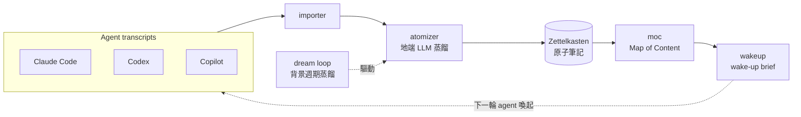

<!--
========================================================================
這是「未來新 public repo」的 README 骨架草稿（B 路線搬遷件，暫存於本 private repo
的 docs/migration/，尚未實際放到新 repo root）。

用途：給作者（你）依此骨架填空、改寫成新 clean repo 的 README.md。
契約來源：issue #102 的驗收條件 + 公開評估報告（260618）§3 / §4 + 附錄 A（#108 重評）。

填寫原則（務必遵守）：
  1. 定位是 reference / personal agent-OS showcase，「不是裝來即用的產品」。全篇語氣對齊此定位。
  2. 誠實優先、戒灌水：experimental / 未啟用 / 未實作 一律明標；不得沿用舊 README 把空殼或
     未 wired 的模組標「完成」。
  3. 此檔含 `<!-- TODO(author): ... -->` 佔位與 `〔…〕` 待填欄位；交付前須全部處理掉。
  4. zh-TW 為主，可加一段英文 summary 擴大受眾（見最後選配區）。
  5. 搬遷前所有範例字串須完成去識別化（見 #101 第三節）；本骨架已用 internal-vcs.example /
     vendor-x / PROJECT-NNNN / org-a / 127.0.0.1 等佔位，作者勿在新 repo 還原回真實值。
========================================================================
-->

# 〔專案名稱〕

<!-- TODO(author): 決定對外用名。舊 private repo 叫 paulshaclaw；對外品牌曾用 PaulShiaBro。
     新 repo 可沿用或另取。此處填最終公開名稱。 -->

> **一句話定位**：這是一套「個人 agent 作業系統（agent-OS）」的**架構參考 / 作品集 showcase** —
> 不是可以 `pip install` 裝來就跑的產品，而是把「24x7 個人 AI agent 工作流」想清楚、
> 並挑出最成熟的核心（**地端 LLM 蒸餾的記憶 pipeline**）開源展示的設計＋實作集。

<!-- 一句話定位是讀者 2 分鐘內判斷「這是什麼」的第一句，請保持「reference / showcase, not a product」基調。 -->

---

## What it is / What it isn't

> 這段是全篇最重要的「期待值校準」。先讓陌生讀者知道**不要**期待什麼，能省下他們（與你）的時間。

**這是什麼（What it is）**

- 一個個人 agent 工作流的**設計 + 核心實作展示**：可讀程式碼、可讀設計文件（openspec / design specs）、可跑測試。
- 重點展示「**transcript → 原子化 → Zettelkasten → MOC → wake-up brief**」這條靠**地端 LLM** 蒸餾的記憶 pipeline（見〔#亮點〕）。
- 一份關於「如何替個人 multi-agent 環境做治理（scope / autonomy / dispatch）」的**思路與骨架**（標 experimental，見〔#誠實狀態表〕）。

**這不是什麼（What it isn't）**

- ❌ **不是**裝起來就能用的成品 / SaaS / 套件。它**重度假設一套特定的個人環境**（見〔#環境前提〕）。
- ❌ **不是**「跑起來就有 AI 幫你管記憶」的一鍵方案——外部依賴（地端 LLM、transcript 來源、tmux/WSL）需自備或自行替換。
- ❌ **不保證**跨環境可移植；它是為作者自己的工作流長出來的，公開是為了**參考價值**而非通用性。

<!-- TODO(author): 若你決定只搬核心（memory + cost + persona/coordinator 設計），在這裡補一句
     「本 repo 為策展式子集，非原始全量系統」會更誠實。 -->

---

## 亮點：Stage 2 記憶 pipeline（皇冠寶石）

> 這是整個專案最成熟、最有份量、也最值得讀的部分（評估報告認定為「最高價值」核心）。

把多家 agent（Claude Code / Codex / Copilot 等）的對話 transcript，透過**地端 LLM** 蒸餾、
逐步轉成可被下一輪 agent 喚起的長期記憶：

```
transcript → 原子化(atomize) → Zettelkasten 原子筆記 → MOC(Map of Content) → wake-up brief
                                   └── 由地端 LLM 蒸餾標題 / 摘要 ──┘
```

**架構圖（Mermaid）**

<!-- TODO(author): 用真實模組關係補完下圖。下面是 placeholder 雛形，依 paulshaclaw/memory/ 下
     atomizer / importer / moc / wakeup / dream / ledger / syncback 的實際資料流校正。
     可用 mermaid-skill 產生。 -->



**為什麼值得看**：踩在「agent memory」這個熱題上，且是端到端、有測試、天天在作者機器上跑的真實實作
（非 demo）。實證：記憶層約 11k LOC、對應測試大量；當前 knowledge 已累積數百則 slice。

<!-- TODO(author): 確認要不要公開「435 slices / 289 帶標題」這類個人運行統計。屬個人筆記內容量，
     可保留作「真的在跑」的佐證，也可改成範圍級描述避免揭露個人資料量。 -->

---

## Getting started / 環境前提

> ⚠️ **先讀這段再 clone。** 本專案**死綁一套特定個人環境**；缺了下列前提，多數功能跑不起來。
> 設計上已盡量把對個人 infra 的依賴抽成 **config / 可關閉開關**，但「自備或替換外部依賴」是使用前提。

**假設的環境（Assumptions）**

| 前提 | 說明 | 缺了會怎樣 / 如何替換 |
|---|---|---|
| **WSL / Linux** | 開發與運行平台 | 其他平台未測試 |
| **tmux** | 多 pane / 多 agent 協作載體 | 無 tmux 則跨 pane 協作不可用 |
| **地端 LLM endpoint** | 記憶蒸餾的後端（OpenAI/Anthropic 相容介面） | **必備**；無則 atomize/wake-up 不運作。endpoint 走 config，預設請填 `http://127.0.0.1:〔port〕`（範例佔位，非真實位址） |
| **transcript 來源格式** | 假設特定 agent CLI 的 transcript 落地格式 / 路徑 | 格式不符需自行寫 adapter；路徑走 config |
| **狀態 / secret 路徑** | runtime 狀態與密鑰**放在 repo 外**（例：`~/.agents/`、`~/.config/〔app〕/`） | 路徑走 config；secret 不入庫（見〔#安全〕） |

**安裝 / 試跑（骨架）**

<!-- TODO(author): 補真正的 getting-started 步驟。舊 README 寫「本 repo 為文件庫、無需安裝」——
     新 repo 必須給「怎麼把核心跑起來 / 怎麼只跑測試看它是真的」的最小路徑。下列為 placeholder。 -->

```bash
# 1. 取得程式碼
git clone 〔new-repo-url〕
cd 〔repo〕

# 2. 安裝相依（Python）
pip install -r requirements-〔…〕.txt     # 或 pip install -e .

# 3. 設定環境前提（複製範例 config 後填入你自己的 endpoint / 路徑）
cp 〔config.sample.yaml〕 〔config.yaml〕
#   - 地端 LLM endpoint（OpenAI/Anthropic 相容）
#   - transcript 來源路徑
#   - 狀態 / secret 目錄（repo 外）

# 4. （建議）先只跑測試，確認核心是真的（見「測試 / 驗證」）
pytest tests/ 〔memory tests 路徑〕
```

<a id="安全"></a>
**安全 / 不入庫的東西**：密鑰、token、個人狀態一律放 repo 外（透過 config 指向 `~/.config/...`、
`~/.agents/...`）。請勿把任何真實密鑰、內網主機名、客戶 / 專案代號寫進 repo
（搬遷去識別化規範見開發說明）。

---

## 誠實狀態表

> **戒灌水。** 下表據實標各模組完成度與**是否真的接進 runtime**。`experimental` / `shadow` /
> `未實作` 一律明標——寧可低報，不可像舊 README 把空殼或未啟用模組標「完成」。
>
> 圖例：✅ 在跑（wired + 天天運行）｜🟢 真實 library（有測試、被動呼叫）｜
> 🧪 experimental / shadow（有測試、有份量，**但未接進 runtime**）｜🚧 未實作 / 空殼。

<!-- TODO(author): 你最終決定搬哪些模組，就只列哪些；沒搬進新 repo 的不要列（避免讀者找不到對應代碼）。
     下表已依評估報告 + 附錄 A(#108) 的實證值填好，作者按實際搬遷範圍刪減即可。 -->

| 模組 | 角色 | 完成度（實證） | runtime 狀態 | 標記 |
|---|---|---|---|---|
| `memory`（Stage 2 記憶 + dream） | 記憶 pipeline（皇冠寶石） | ~11k LOC / 94 檔，測試大量 | 端到端在跑 | ✅ |
| `cost`（Stage 8 用量 footer） | 多家 provider 用量計量（選配搬） | ~1.8k LOC | 在跑 | ✅ |
| `persona`（Phase 0–4） | scope-gate / autonomy / config-loader 治理骨架 | ~759 LOC，測試齊 | **未接進 runtime** | 🧪 shadow |
| `coordinator` | multi-agent dispatch / registry / seams | ~642 LOC / 7 檔，測試齊 | **未接進 runtime** | 🧪 shadow |
| `tui`（Stage 1） | 早期 TUI 嘗試 | **僅 ~19 LOC** | 基本沒做 | 🚧（真 TUI 見 cockpit） |
| `cockpit`（Stage 11） | 實際的 TUI（MVP） | ~933 LOC | MVP 在跑 | 🟢／✅（依搬遷決定） |
| `chat` | chat API model | **0 LOC** | open proposal | 🚧 未實作 |
| `janitor` | 清理（邏輯已併進 memory） | **0 LOC** | — | 🚧 空殼 |

> ⚠️ **特別聲明（persona / coordinator）**：這兩塊有測試、有份量、踩 agent 治理熱題，**但目前尚未
> wired 進任何運行路徑**（core / bot / cockpit 皆未 import）。本 repo 將其作為「**設計 + CLI 展示**」
> 公開，標 **experimental / shadow**；**不宣稱「在跑」**。

<!-- TODO(author): 若你決定不搬 cost / cockpit，把對應列刪掉並調整上面亮點/前提的相依描述。 -->

---

## 測試 / 驗證

> 不必相信 README 自評——**自己跑測試**看核心是不是真的。

```bash
pytest tests/ 〔memory tests 路徑，例：paulshaclaw/memory/tests/〕
```

- 覆蓋現況（實證，HEAD #108 / 2026-06-18）：約 **1198 passed / 1 skipped**（skipped 多為 opt-in
  live 測試，例如需真實地端 LLM 的案例）。
- CI：`.github/workflows/tests.yml` 會跑 `pytest`（搬遷時一併帶過去）。

<!-- TODO(author): 搬到新 repo 後，數字以新 repo CI 實跑為準（策展式子集測試數會少於 1198），
     請更新成新 repo 的真實值，勿沿用舊 repo 數字。 -->

---

## License

<!-- TODO(author): 二選一後，把對應授權檔放到新 repo root 命名為 LICENSE，並在此區塊對齊。 -->

本專案採 **MIT License**（推薦預設：最簡、最寬鬆，適合 showcase）。
完整條款見 repo root 的 [`LICENSE`](./LICENSE)；著作權人佔位：`Copyright (c) 2026 Paul Chen (hamanpaul)`。

> 搬遷件對應檔：`docs/migration/new-repo-LICENSE-MIT.txt`（複製到新 repo root 改名為 `LICENSE`）。

**其他選項（作者決定）**：

- **MIT**（推薦）— 最簡、最寬鬆。
- **Apache-2.0** — 寬鬆 + 明確專利授權，較正式；若在意專利條款選這個。
- **程式 MIT/Apache + 文件 CC-BY-4.0** — 若本 repo 文件（design / openspec specs）比重高、想讓文件
  以「標示出處即可再利用」方式釋出，可程式與文件分別授權。

> ⚠️ 無 LICENSE 檔時，即使 repo 設為 public 仍屬 **all-rights-reserved**，他人不能合法使用。
> 故新 repo root **務必**放一份 `LICENSE`。

---

## （選配）English summary

<!-- TODO(author): 視受眾決定是否加。建議至少放定位 + What it is/isn't 的英文版以擴大讀者。 -->

> 〔A short English version of the one-line positioning + What it is / isn't, to widen the audience.〕

---

<!--
========================================================================
交付前檢查（issue #102 DoD）：
  [ ] 新 repo root 有 README.md（含 定位 / 亮點 / 環境前提 / 誠實狀態 / License）
  [ ] 新 repo root 有 LICENSE
  [ ] 陌生人讀 README 2 分鐘內能答出「這是什麼、能不能跑、跑起來需要什麼」
  [ ] 本檔所有 TODO(author) / 〔…〕 佔位皆已處理
  [ ] 全篇無真實密鑰 / 內網主機名 / 客戶或專案代號（去識別化見 #101）
========================================================================
-->
