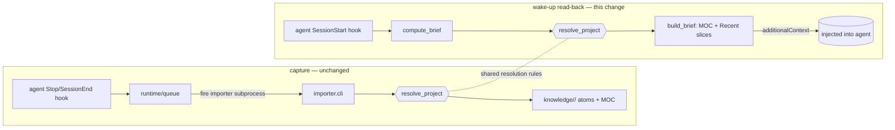

# Stage 2 Memory: End-to-End Read-Back — Design

> Date: 2026-06-10 · Status: approved (brainstorming) · Area: Stage 2 memory hub

## Context (diagnosis)

Stage 2 memory currently captures but does not read back:

- **Capture (write): working.** All four agents (`claude-code`, `codex`, `copilot-cli`, `gemma4`) have `paulsha-memory` capture hooks that fired today (per-agent `runtime/locks/*`, `runtime/ledger/{import,dream,processing,relations}.jsonl` updated). The dream loop runs and distills atoms (217 in `knowledge/`).
- **Read-back (wake-up brief injection): broken.** The `*_session_start.py` (and `*_precompact.py`) hooks run `sys.path.insert(0, Path(__file__).resolve().parents[3])`. Deployed at `~/.agents/memory/hooks/` (a symlink to `~/notes/paulshaclaw/memory/hooks/`), the resolved `parents[3]` is **`~/notes`**, not the repo. That puts `~/notes/paulshaclaw/` (the memory *data* dir) on `sys.path` as a **namespace package** that shadows the editable-installed real `paulshaclaw`. The data dir has `memory/hooks/` but no `memory/importer/` or `memory/wakeup/`, so `compute_brief`'s import fails with `No module named 'paulshaclaw.memory.importer'` → the brief is empty. `hooks.log` shows 29+ `WARN wakeup: failed to import resolver or builder`. Capture is unaffected because it fires the importer in a separate clean `-m` subprocess.
- **Project resolution weak.** Of 217 atoms, 161 (74%) are `_unknown`. `resolve_project` matches `cwd` against a projects config only; sessions outside configured roots (the operator works across many repos: `paulshaclaw`, `arc_prj`, `build20`, …) fall to `_unknown`. Even resolved atoms have `provenance.repo: _unknown` (git remote not captured).
- **Read-back coverage.** `claude-code` and `copilot-cli` have `session_start` wake-up hooks (broken by the bug above). `codex` has only capture (`Stop`/`SubagentStop`); it has **no** wake-up hook, though codex supports the same Claude-style `SessionStart` hook protocol (events `SessionStart`/`SessionEnd`/`Stop`; superpowers injects via codex `SessionStart`).

## Goal & scope

Make the chain **write → distill → read-back-inject** actually work and be useful:

1. **Fix read-back** so the wake-up brief is injected (claude, copilot).
2. **Hybrid project resolution** so atoms map to a real project (repo → working folder → multi-repo tree), sharply reducing `_unknown`.
3. **Add codex read-back** (new `codex_session_start.py` wake-up hook).

**In scope:** the three items above + their tests + redeploy.
**Out of scope (explicit follow-ups):** deepening atom *content* (atoms are currently shallow `touched-files` reports); one-shot re-resolution of the existing 161 `_unknown` atoms; tree-aware briefs that fold a parent node's context into a child's brief. Capture write-path behaviour is unchanged.

## Architecture & data flow



## Component A — read-back import fix

**Cause:** the in-script `sys.path.insert(0, parents[3])`推 `~/notes` onto `sys.path`, creating a namespace-package shadow of `paulshaclaw`.

**Fix:** insert the computed root only when it is a *real package root* (contains `paulshaclaw/__init__.py`), not the memory data dir:

```python
_root = Path(__file__).resolve().parents[3]
if (_root / "paulshaclaw" / "__init__.py").is_file() and str(_root) not in sys.path:
    sys.path.insert(0, str(_root))
```

- Deployed: `~/notes/paulshaclaw/__init__.py` does not exist → no insert → the hooks venv's editable-installed `paulshaclaw` resolves correctly (real package, with `importer`/`wakeup`).
- Repo-dev (running a hook straight from the repo): `<repo>/paulshaclaw/__init__.py` exists → insert (correct).

**Refactor:** extract the repo-root bootstrap into one shared helper (in `_wakeup_common` or a small `_bootstrap` module) used by all session-start/precompact hooks (and the new codex hook), so the logic lives in one place.

**Affected files (repo):** `paulshaclaw/memory/hooks/{claude,copilot}_session_start.py`, `{claude,copilot}_precompact.py` (and the shared helper).

## Component B — hybrid project resolution

Resolution is centralized in `resolve_project`, which takes `cwd` (already recorded by capture — **write path unchanged**) and derives git info itself by running `git -C cwd` (best-effort).

**Precedence (specific → general):**

| # | Condition | project slug | Notes |
|---|---|---|---|
| 1 | `cwd` matches a **config** project root | config canonical name (e.g. `paulshaclaw`) | hybrid "config" face; pins nice names/aliases; keeps existing 56 `paulshaclaw` atoms |
| 2a | in a git repo **with remote** | `owner/repo` via `normalize_remote` (e.g. `hamanpaul/paulshaclaw`) | main repo = project; remote is a stable 2-level path |
| 2b | in a git repo **no remote** | repo dir basename; if parent is a multi-repo workspace → `<parent>/<repo>` | |
| 3 | **not** in a repo | working folder name (`basename(cwd)`) | "no repo → working folder" |
| 4 | `cwd` parent holds **≥2 repos** | tree path `<parent>/<repo>` (or `<parent>` at the parent level) | "multiple repos → tree" |

**Tree = path-style slug.** The slug doubles as the knowledge-layer path, so `knowledge/hamanpaul/paulshaclaw/`, `knowledge/arc_prj/repo-a/`, `knowledge/arc_prj/` (parent) form a tree naturally. Each node may have its own MOC; the brief uses the resolved node's MOC + Recent (parent-context folding is a follow-up).

**Multi-repo detection (rule 4):** scan only the *immediate* subdirectories of the parent for git repos; `≥2` ⇒ treat the parent as a tree workspace and prefix its name. Single-level, bounded, best-effort.

**Provenance:** `resolve_project` also fills `provenance.repo` from the detected remote (currently `_unknown`).

**Existing `_unknown` (161 atoms):** **fix-forward** — new captures resolve correctly. A one-shot re-resolve CLI for old atoms is a follow-up, feasible only if old atoms recorded `cwd`.

**Affected files (repo):** `paulshaclaw/memory/importer/project_resolver.py` (git auto-detect + tree rules + fallback chain); possibly a small `_git.py` helper (bounded `git -C` for toplevel/remote, degrades on failure). Projects config format unchanged.

## Component C — codex wake-up hook + deployment

- **New `paulshaclaw/memory/hooks/codex_session_start.py`:** mirrors claude/copilot session-start — uses the fixed sys.path guard + shared `compute_brief`; emits `{"hookSpecificOutput":{"hookEventName":"SessionStart","additionalContext":<brief>}}`. Any failure → log + empty context + `exit 0`. (Confirm the exact codex `SessionStart` output field during implementation; codex uses the Claude Code hook protocol.)
- **`install.sh` / `uninstall.sh`:** deploy `codex_session_start.py` and wire codex `SessionStart` into `~/.codex/hooks.json` (`managedBy: paulsha-memory`, matcher `startup|clear|compact`) alongside the existing `Stop`/`SubagentStop`. Claude/copilot wiring is unchanged (only the script bodies are fixed).
- **Redeploy:** re-run `install.sh` to push the fixed claude/copilot hooks + the new codex hook to `~/.agents/memory/hooks/` and the agent configs. Hooks fire per-event, so **no agent restart is required**; the next new session picks them up.

## Error handling (hooks must never break a session)

- Every hook keeps its catch-all: on any error → write `log/hooks.log` → emit empty context → `exit 0`.
- Resolver git detection and the multi-repo scan are best-effort: failure degrades (no git → folder name; scan error → no prefix) and **never throws**.

## Testing

- **`test_session_start_hooks.py` regression (locks the bug):** simulate the deployed layout (a namespace `paulshaclaw` dir at the `parents[3]` position) and assert the guard does *not* insert it, the import resolves to the real package, and the brief is non-empty.
- **`project_resolver` units:** config match; in-repo + remote → `owner/repo`; in-repo no remote → repo name; not-in-repo → folder; parent with ≥2 repos → tree slug; genuinely unresolvable → `_unknown` only as last resort. Provenance repo populated from remote.
- **`codex_session_start`:** emits valid JSON `additionalContext` from `compute_brief`; on failure → empty + `exit 0`.
- **git helper:** bounded, degrades on failure.

## Acceptance criteria

1. Starting a `claude` / `copilot` / `codex` session in a known repo injects a **non-empty, correct-project** brief; `hooks.log` shows no wake-up import WARN.
2. New captures across the operator's repos resolve to real projects (repo / folder / tree); the `_unknown` rate drops sharply.
3. codex verifiably receives an injected brief (via a codex session or the hook's output).

## Deployment

Re-run `paulshaclaw/memory/hooks/install.sh`, then start a fresh session to verify. No agent restart needed.

## Follow-ups (not this change)

- Deepen atom content beyond `touched-files` (so briefs say *what* happened).
- One-shot re-resolution of the 161 existing `_unknown` atoms.
- Tree-aware briefs (fold parent-node context into a child's brief).
