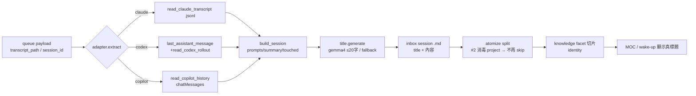

# Stage 2 記憶內容擷取 — 設計（Phase 1）

> 日期：2026-06-16 ｜ 狀態：草案（待覆審）｜ 分支：`feature/stage2-content-extraction`
> 前置脈絡：[[2026-06-10-stage2-memory-readback-design]]、[[2026-06-04-stage2-skillopt-atomize-layer-design]]

## 1. 背景與問題

Stage 2 記憶中樞自 2026-06-08 在實機運行約 8 天。管線「**骨架健康、核心空心**」：hooks 捕捉、importer 觸發、dream 每小時跑、FTS 索引、wake-up 注入全在動，但**沒擷取到任何 session 內容**——所有 inbox session 的 `## Summary`/`## Prompts`/`## Touched files` 皆為 `(none)`。

實機追蹤（程式碼層）確認這是**一條三段斷鏈**，非單一缺陷：

| # | 缺陷 | 根因（檔案/證據） |
|---|---|---|
| 1 | **內容擷取空** | `importer/adapters/*.py` 只把 payload metadata 餵 `build_session`，**從不開 `transcript_path`**。payload 僅含指標：claude 355B（只有 `transcript_path`）、copilot 207B、codex 895B（但已內含 `last_assistant_message`）。 |
| 2 | **atomize 被斜線 project 擋** | PR #80 起 `project_resolver` 對未登錄專案回退成 `github.com/owner/repo` URL 形式（含 `/`）；`atomizer/pipeline.py:251-257` 用 `is_safe_path_component`（`config.py:156-167`，拒含 `/`）→ 每個 post-PR#80 session 被 skip → `atomize.slices:0`（dream ledger 111 次全 `partial`）。 |
| 3 | **promoter=identity，LLM 沒開** | `atomizer.yaml: promoter: identity`；processing ledger 45 筆 promotion **全 `identity`、零 `llm`**。LLM 料件齊全（`llm_promoter.py`、`agent_exec.py`、atomize skill、`test_atomizer_llm_live.py`）但實機從未啟用。 |

使用者要的「每個 session 一條 ≤20 字 LLM 標題」位於這條鏈的**末端**：三段全通才生得出來。

### 已完成的前置

- `~/.claude/settings.json` 已設 `cleanupPeriodDays: 999999`，CC 不再於 30 天後刪 transcript → 內容來源永久保存，**搶救無時間壓力**，既有 35 筆存活 claude transcript 可從容回填。

## 2. 目標與非目標

**Phase 1 目標**（本設計）：
- 三家 adapter（claude / codex / copilot）真正讀出 session 內容：`user_prompts`、`touched_files`、以及供標題生成的 assistant 內容。
- 每個 session 於 **import 當下**用本機 gemma4 產 ≤20 字繁中標題。
- 解除 #2：atomize 不再 skip 斜線 project。
- 三家既有 payload 全回填。

**非目標（明確留給 Phase 2）**：
- #3：`promoter` 由 identity 改為 LLM（gemma4 原子蒸餾、合併/拆分、語意連結）。本期 promoter **維持 identity**，知識層仍為 per-session＋facet 切片，但**從此有真內容＋標題**。

## 3. 關鍵設計決策

1. **標題在 import、per-session**：atomizer 的 promoter 是逐 fragment，與「每 session 一條」對不上。標題改在 import 階段生成、掛在 session 上。
2. **#2 主修法＝atomizer 消毒斜線**：在 atomizer 把含 `/` 的 project 映射成 path-safe 元件（rich `project` 仍留 metadata）→ 對任意專案 robust、不再 skip。**輔以**把 serialwrap/PROJECT-0602/vendor-x 等補進 `~/.agents/config/projects.yaml` 取得乾淨 slug bucket。
3. **gemma4 離線優雅降級**：:8001 目前未監聽。標題生成失敗時 fallback＝首條 user prompt 截斷至 20 字，並標 `title_source: fallback` 供日後 gemma4 上線時補生。import 永不因 LLM 離線而失敗或阻塞。

## 4. 架構與元件

| 元件 | 檔案 | 職責 | 生效 |
|---|---|---|---|
| 共用 transcript reader | `importer/adapters/base.py` | 三格式解析 helper：`read_claude_transcript`、`read_codex_rollout`、`read_copilot_history`；`extract_assistant_summary` 加認 `last_assistant_message`、`history_items` 加認 `chatMessages` | editable，即時 |
| claude adapter | `importer/adapters/claude.py` | 讀 `transcript_path`(.jsonl)→prompts/summary-input/touched，enrich payload 後 `build_session` | editable |
| codex adapter | `importer/adapters/codex.py` | 用 payload `last_assistant_message`（summary/標題輸入）＋讀 rollout→prompts（缺檔則留空） | editable |
| copilot adapter | `importer/adapters/copilot.py` | 由 `session_id` 定位 `~/.copilot/history-session-state/`→`chatMessages`→prompts/summary-input | editable |
| 標題生成 | `importer/title.py`（新） | 叫 gemma4（`scripts/claude-gemma4` 或 :8001）產 ≤20 字繁中標題；離線 fallback＋`title_source` 標記 | editable |
| #2 project 消毒 | `atomizer/config.py` + `atomizer/pipeline.py` | 新增 `sanitize_project_component()`；split/promote/knowledge 路徑改用消毒值；`project` 原值留 metadata | editable |
| projects.yaml 補登 | `~/.agents/config/projects.yaml` | 補 serialwrap/PROJECT-0602/vendor-x 等活躍專案的 slug/roots/remotes | 設定 |
| 回填 | `importer/backfill.py`（新） | 對 `archive/queue/**/*.json` 強制重抽（繞 checksum dedup），三家回填，具 `--dry-run`、可重入 | 手動跑 |

> **部署性質**：上述程式碼皆在 `pip install -e` 的套件內 → 改完**下次 hook 觸發即生效，不必重跑 install.sh**；hook entry 檔（`~/.agents/memory/hooks/*.py`）完全不動。

### 資料來源格式（已實機驗證）

- **claude** `.jsonl`：每行 `type` ∈ {user, assistant, ...}；`message.role`/`message.content`；assistant content 為 block 陣列（thinking/text/tool_use）；`tool_use` name=Write/Edit 之 `input.file_path` → touched_files；user content 為字串 → prompts。
- **codex**：payload `last_assistant_message`（字串，即末則回覆）；prompts 需解 `~/.codex/sessions/YYYY/MM/DD/rollout-*.jsonl`。
- **copilot**：`~/.copilot/history-session-state/session_<sid>_*.json` → `chatMessages: [{role, content}]`。

### 標題欄位語意

`assistant_summary` 設為 gemma4 產的 ≤20 字標題（即使用者要的「摘要成標題」），渲染於 inbox session `## Summary` 與 frontmatter `title:`。較長的末則 assistant 內容僅作為 gemma4 輸入、不另存（transcript 已永久保存可回溯）。`title_source` ∈ {gemma4, fallback}。

## 5. 錯誤處理

- **gemma4 離線/逾時**：fallback 標題（首條 prompt 截斷）＋`title_source: fallback`；不阻塞、不失敗。
- **transcript 已刪**（claude 12 筆 dead pointer）：內容留空、跳過，不報錯。
- **rollout/history 缺檔**：該欄位留空，其餘照常。
- **backfill**：`--dry-run` 預檢；重入安全（同一 payload 可重抽覆寫）。

## 6. 測試策略（TDD，Copilot 於 worktree 實作）

repo 已有 `paulshaclaw/memory/tests/`，CI `tests.yml` 執行（滿足 R-19）。

1. **紅燈先行**：fixtures——一段 claude `.jsonl`、一個含 `last_assistant_message` 的 codex payload、一個 copilot history 檔。斷言三家抽出非空 prompts/summary-input/touched。
2. **title.py**：**mock LLM**，測 gemma4 正常路徑（截斷至 20 字）與離線 fallback 路徑（標 `title_source`）。
3. **#2 消毒**：`sanitize_project_component` 單元測試（`github.com/hamanpaul/serialwrap` → path-safe）；atomize 整合測試斷言斜線 project 不再被 skip、產出 slice。
4. **端到端整合**：fixture queue → 跑 importer → 斷言 inbox `.md` 有內容＋非空標題。
5. **不依賴實機 gemma4**：CI 全綠；`test_atomizer_llm_live` 維持 live-only/skip。

## 7. 回填與驗證

- **回填**：`backfill.py` 對既有 queue 三家強制重抽——claude 35 筆存活 transcript、codex 41 筆（payload 內含）、copilot 15 筆 history；dead pointer 留空。
- **完工定義**：
  1. 新 session → inbox 內容＋標題非空。
  2. 回填後 → 35+41+15 筆有內容＋標題。
  3. dream 下一輪 `atomize.slices > 0`（斜線 project 不再 skip）。
  4. wake-up MOC → 出現 ≤20 字真標題而非空 facet 殼。

## 8. 風險

- gemma4 端點需另行啟動；本期靠 fallback＋補生機制脫鉤，但「真標題」品質取決於 gemma4 上線後補跑一次。
- #2 消毒改變 knowledge bucket 命名（斜線→`__`）；以 projects.yaml 補登活躍專案緩解，使其落在乾淨 slug。
- 回填會覆寫既有 inbox/knowledge；以 `--dry-run`＋可重入降風險。

## 9. Phase 2（本期不做，先記錄）

`promoter: identity → llm`：啟用 gemma4 原子蒸餾，知識層由 facet 切片升級為合併原子筆記（Zettelkasten）。屬「打開開關＋驗證整線」而非從零接，但實機從未跑過，需獨立 spec/plan/驗證。
