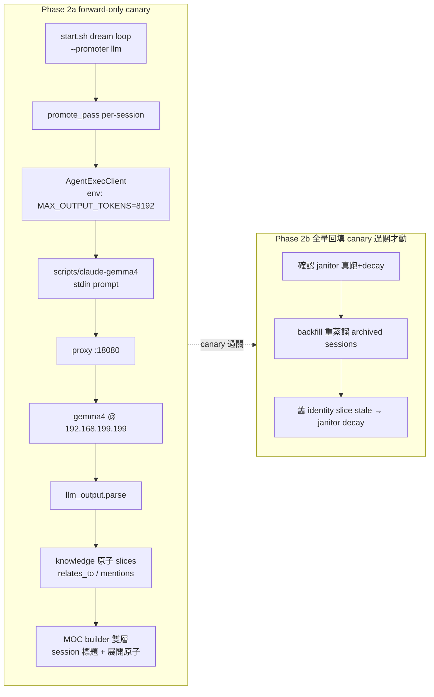

# Stage 2 Phase 2 — promoter identity → LLM 原子蒸餾 設計

> 日期：2026-06-17 ｜ 狀態：草案（待覆審）｜ 分支：`feature/stage2-phase2-llm-promoter`
> 前置脈絡：[[2026-06-16-stage2-content-extraction-design]]（Phase 1）、[[2026-06-02-stage2-llm-atomizer-design]]（LLM atomizer 料件）

## 1. 背景與問題

Phase 1（PR #93-97）已把記憶管線「核心空心」補實：三家 adapter 真讀 transcript、每個 session 在 import 當下產 ≤20 字 gemma4 標題、解除斜線 project 封鎖。**但知識層仍是 `promoter: identity`** —— 把 session 依標題 heading 切成 per-fragment「facet 切片」，1 fragment → 1 slice，無語意合併、無關聯。

實機現況（2026-06-17 量測）：

- `knowledge/` 451 條 slice，processing ledger 68 筆 promotion **全 `identity`、零 `llm`**。
- LLM 蒸餾料件**早在 2026-06-02 就全數備齊且接好線**：`LLMPromoter`、`prompt.py`、`llm_output.py`、`agent_exec.py`（含 `CachingAgentClient`）、種子 skill `atomize-knowledge-slice.md`、CLI `_build_promoter` 在 `promoter: llm` 時組出完整 LLM 管線、fail-closed 語意。**但實機從未跑過 `llm`。**

真正的開關不在 `atomizer.yaml`（雖然它也寫 `identity`），而在 **`scripts/start.sh:195`**：dream loop 寫死 `--promoter identity`。Phase 2 的核心就是把它翻成 `--promoter llm` 並驗證整線。

LLM 呼叫路徑（已驗證）：atomizer `AgentExecClient` → `scripts/claude-gemma4`（headless claude CLI，prompt 走 stdin）→ 本機 proxy `:18080` → gemma4 `gemma4-26b-a4b-nvfp4` @ 192.168.199.199。backend 常駐不下線；本機 `:8001` 與此路徑無關。

## 2. 目標與非目標

**目標（分兩段交付）**：

- **Phase 2a — forward-only canary**：翻開關讓**新進 session** 走 LLM 原子蒸餾，舊 451 條 identity slice 暫不動；觀察品質與穩定度。
- **Phase 2b — 全量回填**：canary 過關後，對所有 archived session 重蒸餾，舊 identity slice 交 janitor decay 收尾，知識層收斂為純 LLM 原子。
- MOC / wake-up 升級為**雙層導覽**：per-session 標題當主脊，底下掛該 session 蒸出的原子（靠 `distilled_from` 反查）。

**非目標（明確不做，留給 Topic 5 / 後續）**：

- ❌ 跨 session 全域實體圖（MTK / BRCM…）。Phase 2 的 relations 維持 per-session batch 內（`relates_to` + `mentions`）。
- ❌ SkillOpt 優化迴圈（critic + validation set 迭代種子 skill）。
- ❌ retrieval 消費語意 relations（Topic 7）。
- ❌ 改 splitter / ledger / pipeline 骨架——只翻 promoter + 加 token env + 改 MOC builder + 加 backfill 路徑。

## 3. 關鍵設計決策

1. **分段：forward-only canary → 全量回填**。先低風險翻開關試水（新 session 走 LLM），canary 過關才補跑全量回填取代舊 451 條。canary「過關」判準留 **judgement call**（看新 session 原子品質 + 穩定度，不設硬性天數 / 門檻）。
2. **MOC 雙層、相容混血**。canary 期間知識層是 identity（舊）+ llm（新）混血；MOC builder 階層化後必須優雅處理兩態——有原子的 session 可展開、無原子的只顯示 per-session 標題。
3. **gemma4 可用性靠既有基礎建設**。backend @ 192.168.199.199 常駐；claude-gem 可由 paulshiabro `/agent %x start` 在閒置 pane 拉起、`/agent` 查線上狀態；Phase 2 生命週期跟著 `scripts/start.sh`。fail-closed 已內建：gemma4 / proxy 斷線時該 session 留在 split、下輪 dream 重試，不掉資料、不阻塞。
4. **輸出 token 窗：atomizer 在 subprocess env 設大**（決策 A）。`scripts/claude-gemma4:143` 為 bro 短聊設 `CLAUDE_CODE_MAX_OUTPUT_TOKENS=1024`，但 atomize 輸出是「一 session → N 原子的 JSON 陣列」，1024 會截斷 → JSON 壞 → fail-closed → session 永卡 split。修法：`AgentExecClient` 加 `env` 覆寫能力，atomize 呼叫時設較大 `CLAUDE_CODE_MAX_OUTPUT_TOKENS`。gemma4 有 256k context，輸入吃得下；**輸出窗預設 8192、可在 config 調**（不開到 256k，避免 runaway）。

## 4. 架構與元件

### Phase 2a — forward-only canary

| 元件 | 檔案 | 職責 / 改動 | 生效 |
|---|---|---|---|
| 輸出窗 env override | `atomizer/agent_exec.py` | `AgentExecClient.__init__` 加 `env: dict\|None`；`subprocess.run(..., env={**os.environ, **env})`；env=None 時維持繼承父 env（向後相容） | editable |
| token config | `atomizer/config.py` + `atomizer.yaml` | `agent_exec.max_output_tokens`（預設 8192，正整數驗證）；併入 config_hash | editable |
| CLI 組裝 | `atomizer/cli.py:_build_promoter` | 建 `AgentExecClient` 時把 `max_output_tokens` 組成 `{"CLAUDE_CODE_MAX_OUTPUT_TOKENS": str(n)}` 傳入 env | editable |
| 翻開關 | `scripts/start.sh:195` | dream loop `--promoter identity` → `--promoter llm` | 改後重啟 start.sh 生效 |
| 雙層 MOC | `memory/moc/moc_builder.py` | 階層化：per-session 標題主脊 + 靠 `distilled_from` 反查掛原子；相容「無原子」session（只顯示標題）| editable |
| 觀測 | 沿用 `runtime/ledger/processing.jsonl` | 已記 `promoter` / `model` / `skill_hash`（design F）；canary 靠它 + 直接讀新 `knowledge/` 原子判品質；必要時加輕量 `atomize report`（per-session：#fragments→#slices、fail-closed 數） | — |

> **部署性質**：`agent_exec.py` / `config.py` / `cli.py` / `moc_builder.py` 皆在 `pip install -e` 套件內 → 改完下次 dream 觸發即生效。唯一需重啟的是 `start.sh`（翻 `--promoter llm`）。hook entry 檔不動。

### Phase 2b — 全量回填（canary 過關才動）

| 元件 | 檔案 | 職責 / 改動 |
|---|---|---|
| janitor 驗證 | （實測，非程式改動） | 確認 janitor 在 dream loop 真的跑；content-derived `slice_id` 變動後，舊 identity slice 被判 stale 並 decay。若 janitor 未涵蓋，補上路徑或手動清。 |
| 回填腳本 | `atomizer/` 新增 backfill 路徑（或擴 `cli.py`） | 對 archived session 強制重蒸餾（繞 checksum dedup、可重入、`--dry-run`）；舊 identity slice 交 janitor decay |

## 5. 三個技術風險與處置

| # | 風險 | 根因 / 證據 | 處置 |
|---|---|---|---|
| R1 | **輸出截斷 → session 永卡** | `claude-gemma4:143` `MAX_OUTPUT_TOKENS=1024`；`AgentExecClient` 不覆寫 env；多原子 session JSON 超 1024 → parse 失敗 → fail-closed → 每輪重試皆敗 | 決策 A：atomizer 設 env `CLAUDE_CODE_MAX_OUTPUT_TOKENS=8192`（可調） |
| R2 | **janitor 未必真 decay 舊 slice** | 全量回填前提是 janitor 跑且會收 stale；start.sh dream 指令未確認帶起 janitor | Phase 2b 前實測；未涵蓋則補路徑 |
| R3 | **canary 期 MOC 混血** | 新 session 有原子、舊 451 條是 facet；builder 不能假設全有原子 | 雙層 builder 相容兩態，無原子只顯示標題 |

## 6. 錯誤處理（沿用既有 fail-closed，本期確認不破壞）

| 失敗 | 處置 |
|---|---|
| gemma4 / proxy 斷、timeout、非零退出、空輸出 | fail-closed：session 留 split，下輪 dream 重試，不掉資料 |
| JSON 壞 / schema 不過（含 R1 截斷）| fail-closed（整 session all-or-nothing）|
| slice 驗證（Stage3 ∪ T4）不過 | fail-closed |
| cache 損壞 | 視為 miss、重叫，不 fail |
| `relates_to` target 解析不到 | 跳該邊 + warn，不 fail |

log 絕不記 LLM 原始輸出 / session 內文（只記失敗類別 + session_key + skill/config hash）。

## 7. 測試策略（TDD）

repo 已有 `paulshaclaw/memory/tests/`，CI `tests.yml` 執行（R-19）。LLM 為外部非確定性 → 注入 `FakeAgentClient` / stub 命令做確定性測試；真 gemma4 走 opt-in（`test_atomizer_llm_live.py`，CI 不跑）。

1. **agent_exec env**：`AgentExecClient(env={...})` 時 `subprocess.run` 收到合併 env；env=None 維持繼承（向後相容）。stub 命令印出 `CLAUDE_CODE_MAX_OUTPUT_TOKENS` 斷言被帶入。
2. **config**：`agent_exec.max_output_tokens` 解析、預設 8192、非正整數 raise、併入 config_hash。
3. **CLI 組裝**：`_build_promoter` 在 `llm` 時把 `max_output_tokens` 正確組成 env 傳給 `AgentExecClient`。
4. **MOC 雙層**：fixtures 含「有 `distilled_from` 原子的 session」與「無原子 session」→ 斷言階層 + 混血相容（無原子只顯示標題、不報錯）。
5. **端到端（fake/stub）**：promote_pass(llm fake) → 原子寫出、relations 進 jsonl、processing 記 `promoter=llm`+`model`+`skill_hash`；fail-closed（壞輸出 → session 留 split、零 slice）。
6. **回歸**：`unittest discover -s paulshaclaw/memory/tests` 與 `tests/` 全綠；CI 不依賴實機 gemma4。

## 8. 回填與驗證

- **Phase 2a 完工定義**：start.sh 翻 `--promoter llm` 後，新進 session 於 `knowledge/` 產生 LLM 原子（多原子、帶 relations）、processing 記 `promoter=llm`；MOC 雙層顯示 session 標題 + 可展開原子；gemma4 斷線時 fail-closed 不掉資料。
- **canary 判準**：judgement call —— 人工讀新 session 蒸出的原子，看 one-concept-per-slice、合併/拆分、project 歸屬、relations 是否合理；穩定度看 fail-closed 率是否可接受。不設硬性天數 / session 數 / 門檻。
- **Phase 2b 完工定義**：janitor 確認在跑；backfill 重蒸餾全部 archived session 後，舊 identity slice 由 janitor decay；知識層收斂為純 LLM 原子；MOC 全程不破。

## 9. 風險彙整

- **R1 輸出截斷**（已由決策 A 處置）：8192 仍不足的超大 session 可再調 config。
- **R2 janitor**：Phase 2b 的硬前提，先實測。
- **R3 混血 MOC**：builder 相容兩態緩解。
- **品質**：種子 skill 從未在真 gemma4 跑過 → 靠 forward-only canary 先暴露問題，SkillOpt 優化留後續。
- **回填覆寫**：backfill `--dry-run` + 可重入 + Phase 2a 已驗證整線後才動，降風險。

## 10. 邊界（非本期範圍）

跨 session 全域實體圖、SkillOpt 迴圈、Topic 7 retrieval、改動 Stage 3 schema / splitter / ledger 骨架——皆不在 Phase 2。
