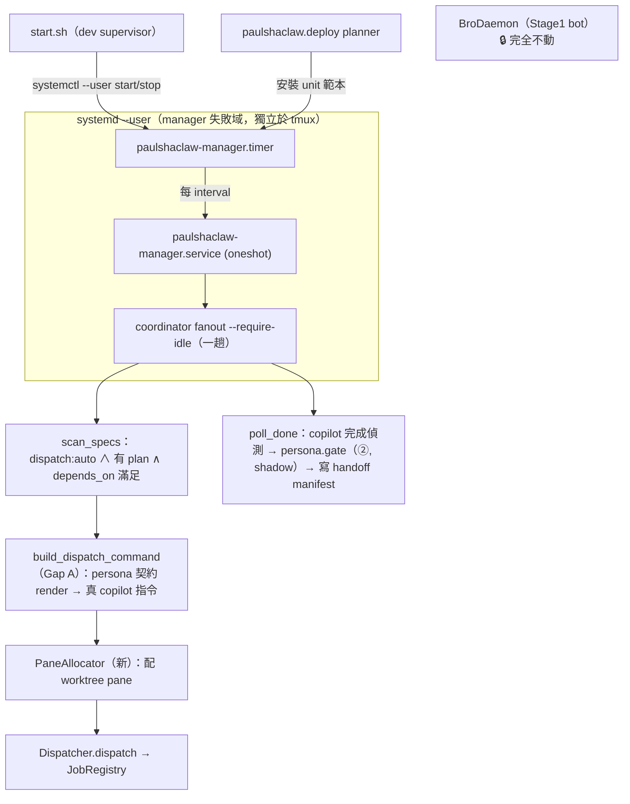

# Persona Manager Daemon — 把派工護欄通電成獨立 systemd 服務 設計

> 日期：2026-06-22 ｜ 狀態：草案（待覆審）｜ 分支：`feature/persona-manager-daemon`（待開）
> 前置脈絡：`2026-06-18-persona-dispatch-guardrail-design.md`（把 persona 從孤島變派工護欄的整體設計，Phase 0–4 已 archive）。本設計接續其「§9 manager fan-out」並回答「如何接上 live paulshaclaw」。

## 1. 背景與問題

persona-dispatch-guardrail 設計的五個 phase（contract→config / shadow gate / coordinator CLI / scope CI / autonomy）程式碼與測試都齊了，但**整套仍是 dormant 的**——三個子系統各自存在、各自測過，彼此之間的線一條都沒接：

- **Gap A（persona ↔ coordinator）**：`coordinator.autonomy.dispatch_ready` 送進 Dispatcher 的 `command` 是**佔位註解**（`# dispatch {slice_id} (plan=...)`，autonomy.py），`persona` 只是記進 registry 的不透明字串。`build_persona_context`／`render`／`validate_handoff_message` 在 production 0 命中——設計核心「① 契約 render 進 prompt」從未發生。
- **Gap B（coordinator ↔ live runtime）**：跑著的 `core/daemon.py: BroDaemon` 用 `LocalCoordinator`（counter stub）；新的 `Dispatcher`+`JobRegistry` 它從未 instantiate。Telegram `/dispatch` 到今天仍打到 stub。
- **Gap C（完成偵測，§13 未解）**：`Dispatcher.poll_done` 靠 branch 新 commit、`autonomy.default_is_satisfied` 靠 handoff `gate_status=='passed'`；copilot `--yolo` 跑完的可靠訊號未定。

本設計的目標是**通電**：讓就緒的 task 真的被派出去、被治理、被完成偵測，且**完全不碰 live bot 的 critical path**。

## 2. 架構決定：獨立 systemd 服務（不寄生於 BroDaemon）

manager 不接進 `BroDaemon`，而是成為**自己的服務**，由 systemd `--user` 管理，start.sh 僅負責 start/stop。

理由：
- **stage 獨立（CLAUDE.md 硬性偏好）**：bot 是最上游、最關鍵的 Stage 1。manager 自成失敗域 → 它 crash/卡死不連累 bot；符合「下游 stage 失敗不能連累上游」。
- **既有慣例**：repo 的 deploy 平面已用 systemd `--user` unit（`deploy/templates/core/systemd/__INSTANCE__-telegram.service.tmpl`；`docs/ops/recovery.md` 的 `paulshaclaw-telegram.service` / `paulshaclaw-janitor.service`）。manager 是這個家族的新成員，不是新基礎建設。
- **語意對齊 dream/cost**：Stage 2 dream / Stage 8 cost 是「sleep N 跑一趟」的 interval oneshot。`coordinator fanout` 本身就是一趟掃描→派工→退出。systemd `.timer`（`OnUnitActiveSec`）正是這語意的 idiomatic scheduler；idle-gate 留在 Python（`--require-idle`，沿用 dream 同款）。

> **與 memory「dream 走 start.sh loop（非 systemd）」的刻意分歧**：dream/cost 維持 start.sh loop 不動；**只有 manager 走 systemd**。manager 因此**不再綁 tmux 生命週期**（不適用「tmux 死＝全重啟」）——這正是要的：manager 取得 journald、restart policy、與 bot 解耦的失敗域。
>
> **此分歧不是反轉 binding 決定**：2026-06-10 reconciliation §② 規劃的 ADR（`openspec/specs/conventions/adr-001-always-on-deployment.md`）**從未實際寫出**——該目錄現只有 `docs-layout.md`。原始 research/05 §7.3 本就要求三 always-on 各自 systemd unit（其一即「含 Manager orchestrator 的 daemon」），6/10 只是把規格降級遷就「實態從來是 start.sh」，而非拆掉能跑的 systemd。故本 spec 對 manager 採 systemd，等於**部分落地當初未竟的 §7.3**，且為下一步 repo 切包預備服務化形狀（見 §3 非目標）。此分歧仍需回寫 memory `feedback_operational_preferences` / `project_stage2_install_state`。

### 形狀

```
paulshaclaw-manager.timer      # OnBootSec + OnUnitActiveSec=<interval>；觸發 .service
   └─► paulshaclaw-manager.service   # Type=oneshot
          └─► python -m paulshaclaw.coordinator fanout \
                 --specs-dir docs/superpowers/specs --require-idle   # 一趟 tick
```



## 3. 目標與非目標

**目標**
- manager 成為獨立 systemd `--user` 服務（timer+oneshot），start.sh 退成 start/stop 瘦殼，bot 零改動。
- 補 **Gap A**：新增純函式把 persona 契約 render 成真 copilot 指令，取代 `dispatch_ready` 的佔位 command。
- 補 **pane 配置**：以可注入 seam 配置/回收 worktree pane，取代 `%{i}` 佔位。
- 全程 **shadow enforcement**：gate 只觀察、恆放行；偵測或派工出錯只讓 job 卡住，不傷任何 live 服務。
- canary：單一 `dispatch:auto` slice 真的跑一輪、端到端串起來。

**非目標**
- ❌ 改 `BroDaemon` / `LocalCoordinator` / Telegram `/dispatch`（Gap B 由「manager 自成服務」繞過，不是融合）。
- ❌ 把 dream/cost 也改 systemd（正交，另案）。
- ❌ 翻 `enforcement: enforce` 或設 required check（屬後續，先把 shadow 通電跑順）。
- ❌ 即時 wrapper 攔截 copilot 每個工具呼叫（沿用原設計：以 PR diff 後驗為主）。
- ❌ **repo 切包**（memory／lifecycle／persona+coordinator 抽成獨立 repo）。實測相依已乾淨（四包零 import core/bot；tmux 僅 `coordinator/seams.py` 一檔躲在 `PaneSender` Protocol 後；真正切點是「lifecycle 為共用底座→實為三包」與「獨立服務時 agent executor 是否脫離 tmux」）。本 spec 是切包的**墊腳石**（coordinator 服務化 + Gap A 把 persona/coordinator 綁成內聚單位），但切包本身與「dream/cost 也改 systemd」一律另案，先在現有 tmux 下把 persona 通電並驗證。

## 4. 組件設計

### 4.1 Gap A — `build_dispatch_command`（新純函式）

新增 `paulshaclaw/coordinator/contract_command.py`，**這是 coordinator → persona 的那條線**：

```
build_dispatch_command(role: str, *, task: str, plan_path: str,
                       executor: tuple[str, ...] = DEFAULT_EXECUTOR,
                       catalog=None) -> str
```

- reuse `persona.render.render_contract_prompt(role, catalog)`（內部走 `build_persona_context`）成 PROMPT 開頭約束段，拼成 `copilot --model gpt-5.4 --yolo -p "<契約段>\n\n[TASK] <task>\n[PLAN: <plan_path>] …"`，以 `shlex.join` 收成可送進 pane 的安全單行。
- **純字串函式、零 I/O**：只嵌 `plan_path` 參照（copilot 在 worktree 內自行讀計畫），不在此讀檔，故不破壞既有 fanout 測試。未知 role → `ValueError`（由 `render_contract_prompt` 冒泡）。
- `autonomy.dispatch_ready` 的 `command=` 改 import 本函式產出（取代佔位註解）。`dispatch_ready` 已先以 `ready_units` 篩掉無 plan 者，故此處 `plan_path` 必存在。
- **handoff manifest 驗證不在此層**：fan-out 派工當下尚無 builder→reviewer manifest（manifest 由 manager 於 copilot 完成後、PR/gate 時才寫，見 §4.3 step 3 / §6）。`validate_handoff_message` 屬 ② gate（Phase C），非 ① 派工。

### 4.2 pane 配置 — `PaneAllocator`（新 seam）

`dispatch_ready` 現以 `f"%{i}"` 佔位。新增 seam：

```
class PaneAllocator(Protocol):
    def acquire(self, slice_id: str) -> str: ...   # 回 pane_id
    def release(self, pane_id: str) -> None: ...
```

- 真實作：在專用 tmux session/window `tmux split-window` 配 pane、`break-pane`/`kill-pane` 回收；鏡射 `seams.TmuxPaneSender` 的 tmux 慣例。
- 單元測試注入 fake（不開真 tmux）。
- manager tick 對每個就緒單位 `acquire` → 派工；job done（poll）後 `release`。

### 4.3 manager tick — reuse `coordinator fanout`，補 poll 段

每次 timer 觸發 `coordinator fanout` 一趟，職責：
1. `scan_specs` → 取 `dispatch:auto ∧ 有 plan ∧ depends_on 全滿足` 就緒集。
2. 對未派工的就緒單位：`PaneAllocator.acquire` → `build_dispatch_command` → `Dispatcher.dispatch`。
3. 對 in-flight job：`poll_done`；偵測完成者 → 跑 `persona.gate`（② diff gate，shadow）→ 依結果寫 `runtime/handoff/<slice_id>.json`（含 `gate_status`）→ `PaneAllocator.release`。
4. handoff manifest 落地後，下一 tick 的 `default_is_satisfied` 即可釋放其下游（depends_on 滿足）→ fan-out 自然推進。

`--require-idle`：1-min load average 高於門檻時整趟跳過（沿用 dream 同款 idle gate），避免與互動式工作搶資源。

### 4.4 systemd units + start.sh + deploy

- repo 新增 unit 範本：`deploy/templates/core/systemd/__INSTANCE__-manager.service.tmpl`（`Type=oneshot`）+ `__INSTANCE__-manager.timer.tmpl`（`OnBootSec` + `OnUnitActiveSec=${PSC_MANAGER_INTERVAL_SECONDS}`）。對齊既有 telegram unit 範本結構，由 `deploy.planner` 納入產物。
- 本機安裝：unit 連結/複製到 `~/.config/systemd/user/` + `systemctl --user daemon-reload` + `enable`（提供 `scripts/coordinator/install-manager-units.sh`）。
- start.sh：以 `start_manager_service()` 取代「若是 loop 則 start_*_loop」——內容為 `systemctl --user start paulshaclaw-manager.timer`（`PSC_MANAGER_DISABLED=1` 時 skip）；`cleanup()` 加 `systemctl --user stop paulshaclaw-manager.timer`。**start.sh 不再擁有 manager 進程**，只 toggle。
- enforcement：沿用 `personas.yaml`；本設計順帶補上設計 §4 缺的全域 `enforcement: shadow` 旗標（無行為改變，僅顯式化）。

## 5. 失敗域與錯誤處理

- oneshot 任一步 raise → systemd 記 `failed`、寫 journald；下一 tick 照常重試（無狀態殘留：registry 為真相）。
- idle gate 未過 → 整趟乾淨跳過（exit 0），不留半成品。
- shadow：`persona.gate` 恆 exit 0、只 annotate，違規不擋——通電期任何誤判都不阻塞。
- fail-closed：`build_dispatch_command` 驗 handoff 失敗、`PaneAllocator.acquire` 失敗 → 該單位本 tick 不派，不影響其他單位（per-unit 隔離，沿用 Phase 2 worktree/pane 天然隔離）。
- manager 整個 crash → bot/dream/cost 不受影響（獨立 systemd 失敗域）。

## 6. 測試策略

- **Gap A**：`build_dispatch_command` 對三角色 fixture 的輸出含正確契約段、plan 內容；handoff 不合法 → raise／不派。
- **PaneAllocator**：fake 驗 acquire/release 配對、release 後可重用；真實作不在單元測試實體化。
- **tick**：fake Dispatcher/PaneAllocator/git_runner/idle 注入，驗就緒篩選→派工→poll→寫 manifest→release 全鏈；idle 未過時整趟 no-op。
- **systemd/start.sh**：unit 範本 round-trip（deploy planner 產物含 manager service+timer）；start.sh 以 fake `systemctl` 驗 start/stop 呼叫（不碰真 systemd）。
- 既有 persona（11）/coordinator 測試不回歸。

## 7. 分階段交付

| Phase | 內容 | 獨立驗收 |
|---|---|---|
| **A 契約拼裝** | `build_dispatch_command` 純函式 ＋ `dispatch_ready` 改用之 ＋ `personas.yaml` 補 `enforcement: shadow` | 純函式測試；既有測試全綠；零 live 接觸 |
| **B pane 配置** | `PaneAllocator` seam + 真實作 + tick 整合 | fake 注入測試；真實作手動 smoke |
| **C systemd 化** | manager service+timer 範本 ＋ deploy planner 納入 ＋ start.sh 改 start/stop ＋ install 腳本 | unit 範本測試；`systemctl --user` 本機跑得起、journald 有 log |
| **D canary** | 單一 `dispatch:auto` slice 端到端跑一輪（shadow） | 觀察 dispatch→copilot→poll→manifest 串通，bot 全程無感 |

**第一個實作計畫鎖 Phase A**：純函式、零行為改變、解鎖其餘、風險最低。

## 8. 風險與待驗

- **copilot 完成偵測（Gap C）**：`--yolo` 跑完的可靠訊號（branch commit vs sentinel）Phase B/D 實測選定；未定前 fallback sentinel 檔。因 idle+shadow，偵測不準的後果僅「job 卡 dispatched」，不傷服務。
- **WSL `--user` lingering**：timer 在無互動 session 時要跑需 `loginctl enable-linger paul_chen`；start.sh 在 active session 內 start 可不依賴 linger，但開機自啟需確認。Phase C 驗證。
- **tmux 解耦 vs「tmux 死＝全重啟」**：manager 走 systemd 後不隨 tmux 重啟而重啟——此為刻意取捨（換取失敗域隔離），需回寫 memory `feedback_operational_preferences` / `project_stage2_install_state`。
- **multi-line prompt 的 pane transport（Phase B）**：`build_dispatch_command` 產出的指令含換行（契約段多行），**不可**逕經 `tmux send-keys -l` 逐字送——literal `\n` 會被當 Enter 提早提交、破壞 `-p` 參數。Phase B 的 `PaneAllocator`/transport 須改用 buffer（`load-buffer`+`paste-buffer`）或檔案投遞等不逐字送 newline 的方式；現有 `seams.TmuxPaneSender`（`send-keys -l`）僅適用單行。Phase A 不觸發（無 `dispatch:auto` 就緒單位、command 僅被測試 fake 消費）。
- **fixer 身分**：fix 由哪種非 copilot agent 扮演待定；對 persona 無影響（同 builder 契約），但 `build_dispatch_command` 須支援多 executor。
- **manifest 信任**：CI/gate 讀 `from_role` 決定 scope；改 manifest 降權的風險由「manifest 路徑屬 manager scope、改它即越界」緩解（沿用原設計）。

## 9. 決策紀錄（brainstorm 收斂）

1. **接上目標** = 接進 live runtime（非僅 dry-run / 僅 CI gate）。
2. **接法** = manager **自成獨立服務**繞過 `BroDaemon`，非融合進 bot critical path（守 stage 獨立）。
3. **部署** = systemd `--user` **timer + oneshot**（非 start.sh while-loop、非 long-running service）；start.sh 退成 `systemctl start/stop`。對齊 repo 既有 deploy 平面 systemd 慣例 + dream/cost 的 interval-oneshot 語意。
4. **與 dream/cost 分歧** = 僅 manager 走 systemd；dream/cost 維持 start.sh loop。manager 因此脫離 tmux 生命週期（刻意）。
5. **強制** = 通電期全程 shadow；enforce 翻牌與 required check 屬後續另案。
6. **三 Gap 範圍** = 本設計補 Gap A（契約拼裝）＋ pane 配置；Gap B 由架構決定繞過；Gap C 以 sentinel fallback 延後收斂。
7. **上位動機 = repo 切包預備，但本輪選 B（先通電、後切包）** = systemd 化的真正驅動是「切 repo」（memory 獨立、persona+coordinator 一包、lifecycle 為共用底座）。本輪刻意收斂為 B：先在現有 tmux 下把 persona 串起來、證明 Gap A/C 通，切包與 systemd-for-all 留待通電驗證後另案。manager-systemd 同時是切包的服務化墊腳石。ADR-001 既未落地，本決定不構成對既有 binding 決定的反轉。
