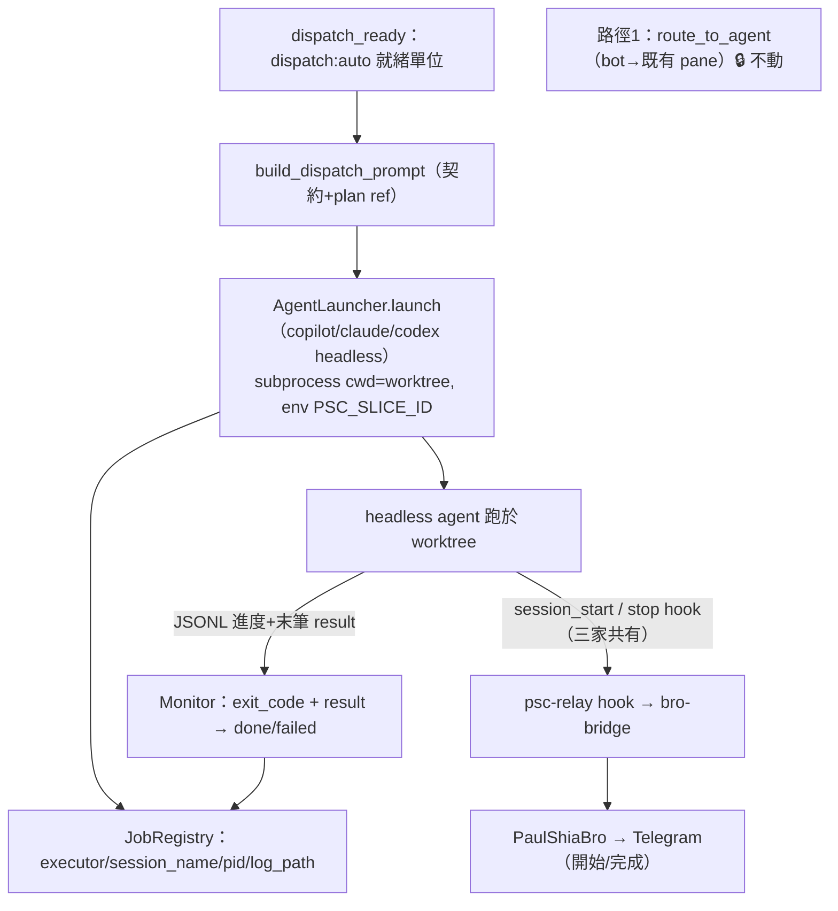

# Persona Manager Phase B — Headless 自主派工 executor 設計

> 日期：2026-06-22 ｜ 狀態：草案（待覆審）｜ 分支：`feature/persona-manager-phase-b`（待開，疊在 phase-a 上）
> 前置：`2026-06-22-persona-manager-daemon-design.md`（umbrella）。**本 spec 取代 umbrella §4.2 的 `PaneAllocator`**（該方向經 brainstorm 否決，見 §3）。

## 1. 背景與校正

umbrella §4.2 原設計「`PaneAllocator` 自建 tmux pane + 把多行 prompt 送進 pane」。Phase A 對抗式 review 指出多行 prompt 不能逕經 `tmux send-keys -l`（literal `\n` 被當 Enter）。brainstorm 進一步釐清**派工有兩條本質不同的路徑**，manager 自主路徑根本不該碰 pane：

- **路徑 1 — 互動（PaulShiaBro / Telegram）**：把 prompt 送進**指定的既有 pane 裡正在跑的 agent**（≈ 現有 `core/daemon.py: route_to_agent` 的 `[bro:<id>]` 送字）。**不自建 pane、非 headless**。本 spec 不動它。
- **路徑 2 — 自主（Manager daemon）**：監控到 `dispatch:auto` todo/plan 時，以 **headless** 方式啟動 agent（`copilot -p` / `claude -p` / `codex exec`），帶 **remote** 旗標，**監控 log/JSONL 確認進度**，記 **session ↔ task mapping**，並透過 agent 原生 hook 把進度 relay 回 PaulShiaBro。

關鍵後果：headless 是 **subprocess argv**，prompt 當單一 arg 直接傳 → 無 shell、無 tmux、無 `send-keys` → review 的多行 transport 問題**消滅**；`PaneAllocator` 不存在。完成偵測（umbrella Gap C）由 **subprocess exit code + 末筆 JSONL result** 取代「branch commit / sentinel」猜測，可靠度大增。

## 2. 目標與非目標

**目標**
- 新增 `AgentLauncher` pluggable seam，提供 **copilot / claude / codex** 三個 headless 真實作（copilot/claude 帶 remote 旗標；**codex 的 remote 走獨立 `remote-control`/app-server，`codex exec` 本身不帶 `--remote`**。皆 JSONL 輸出、cwd=worktree、autonomous 免確認）。
- `build_dispatch_command`（Phase A）重構為**產 prompt 文字**；executor argv 由各 launcher 自組（per-executor 旗標）。
- `JobRegistry` 擴充記 `session_name(=slice_id)` / `executor` / `log_path` / `pid` ↔ task。
- 完成偵測：subprocess exit + 末筆 JSONL。
- 進度 relay：以**三家共有**的 `session_start` + `stop` hook，經現有 bro-bridge 推到 PaulShiaBro。
- 接進 `dispatch_ready`：就緒單位改由 `AgentLauncher` headless 啟動（取代 `%{i}` 佔位 + pane send）。

**非目標**
- ❌ 動路徑 1（`route_to_agent` / bot→pane）。
- ❌ `PaneAllocator` / tmux pane 自建（已否決）。
- ❌ systemd 化（Phase C）、canary（Phase D）。
- ❌ per-tool 細粒度進度 relay（`postToolUse` 非三家共有）—— best-effort、不進核心。
- ❌ handoff manifest ② gate（Phase C）。

## 3. AgentLauncher seam + 三 executor

```
class AgentLauncher(Protocol):
    def launch(self, *, slice_id: str, prompt: str, worktree: str,
               log_dir: str) -> LaunchHandle: ...   # 回 {executor, session_name, pid, log_path}
```

各真實作組自己的 argv（subprocess，cwd=worktree），共同要件：headless prompt、remote、JSONL、autonomous、session 命名。

| 要件 | copilot | claude | codex |
|---|---|---|---|
| headless prompt | `-p <prompt>` | `-p <prompt>` | `exec <prompt>` |
| remote | `--remote` | `--remote-control` | **`codex exec` 不帶 remote**；remote 走獨立 `remote-control` 子命令/app-server |
| JSONL 進度 | `--output-format json` | `--output-format stream-json` | `--json` |
| 完成結果落檔 | `--log-dir <dir>` | （stream-json 末筆） | `-o <dir>/last.json` |
| session↔task | `--name <slice_id>` | `--name <slice_id>` | session id（resume 用） |
| autonomous | `--allow-all` | `--permission-mode acceptEdits`（待核） | `--dangerously-bypass-approvals-and-sandbox` |
| cwd | subprocess cwd | `--add-dir`＋cwd | `-C <worktree>` |

> 真實作 MUST 經 seam 注入；單元測試注入 fake launcher，**不啟動真 subprocess/agent**。executor 旗標細節（尤其 claude autonomous mode、codex remote ADDR）於實作時各跑一次 smoke test 核定。

## 4. prompt 建構（重構 Phase A）

- 抽 `build_dispatch_prompt(role, *, task, plan_path, catalog=None) -> str`：reuse `persona.render.render_contract_prompt` + task + plan_path 參照，產**純文字 prompt**（executor-agnostic，零 shlex/tmux）。
- Phase A 的 `build_dispatch_command`（產 shlex shell 字串）退役/改名為上者——其 shell 包裝是當初遞延的 transport，headless 下不需要。
- 各 `AgentLauncher.launch` 收 prompt 文字 → 組 argv（prompt 為單一 argv 元素）→ `subprocess.Popen`（cwd=worktree）。

## 5. session↔task registry + 完成偵測

- `JobRegistry` job 增欄位：`executor`、`session_name`（=slice_id）、`pid`、`log_path`、`exit_code`。
- 完成偵測（取代 Phase 2 `poll_done` 的 branch-commit）：`pid` 程序結束 → 讀 `exit_code` + 末筆 JSONL `result` → 標 `done`/`failed`。JSONL 不可解時 fallback 用 exit_code。
- 進度（liveness）：tail `log_path`/JSONL 行數或 `session_start` hook → 標 `running`。

## 6. 進度 relay 回 PaulShiaBro（三家共有 hook）

- **一支共用 relay hook script**，註冊於三家各自的 hook 配置、僅綁**共有事件**：
  - copilot：`~/.copilot/hooks/psc-relay.json`（`sessionStart` / `agentStop`）
  - claude：settings.json hooks（`SessionStart` / `Stop`）
  - codex：`~/.codex/hooks.json`（`session_start` / `stop`）
- launcher 啟動時注入 env（`PSC_SLICE_ID=<slice>`、`PSC_RELAY_TARGET=<channel>`）→ hook 繼承 env → script 讀 env + event → 寫進 relay channel（檔/socket/tmux-bridge）→ **復用現有 bro-bridge** 推 Telegram。
- 語意：`session_start` → 「slice X 派工開始」；`stop` → 「slice X 一輪完成」。task 對應由 env 的 `PSC_SLICE_ID` 直接帶（不需反查 session id）。
- **待驗（不擋設計）**：copilot/codex 的 hook 是否在 headless 模式 fire（claude 已知 fire）。Phase B 各跑一次 smoke test 實證；若某家 headless 不 fire，該家退回 §5 的 JSONL 監控由 manager 代為 relay。
- **Smoke status（2026-06-22，已實測三家）**：
  - **copilot**：`-p --remote --name --log-dir --output-format json` 全 argv 正常啟動（rc=0）。✅
  - **claude**：`-p --output-format stream-json` **必須加 `--verbose`**（否則 `Error: ... requires --verbose`）；補後 `--remote-control`+`-p` 共存正常（rc=0）。**headless 下 `SessionStart` hook 確認 fire**、JSONL 帶 `session_id` → relay 機制經實證可行。✅（已修 argv：加 `--verbose`）
  - **codex**：`codex exec` **不接受 `--remote`**（`error: unexpected argument '--remote'`）。✅（已修 argv：移除 `--remote`）
  - **仍 pending**：copilot/codex 的 hook 在 headless 是否 fire（需先安裝 §6 的 relay hook 範本到 `~/.copilot/hooks` / `~/.codex/hooks.json` 再觀察）；claude 已證 fire。

## 7. 資料流



## 8. 錯誤處理 / 失敗域

- launch 失敗（executor 不存在/argv 錯）→ 該 slice 不入 registry、raise，不影響其他 slice（per-slice 隔離）。
- subprocess 非零 exit → job 標 `failed`、保留 log_path 供查；不自動重試（manager tick 下輪再決）。
- hook relay 失敗（bro-bridge 不通）→ 僅丟失一則通知，**不影響 agent 執行或完成偵測**（relay 與 dispatch 解耦、fire-and-forget）。
- JSONL 解析失敗 → fallback exit_code 判定。
- 全程仍 shadow（umbrella §3）：無 ② gate 強擋。

## 9. 測試策略

- `AgentLauncher`：fake launcher 注入，驗 argv 組裝（per-executor 旗標正確、prompt 為單一 arg、cwd/env 帶對）；真實作不在單元測試實體化。
- `build_dispatch_prompt`：契約段 + task + plan ref；未知 role raise（沿用 Phase A 測試形狀）。
- registry：session_name/executor/pid/log_path round-trip。
- 完成偵測：fake exit_code + 假 JSONL（done/failed/壞 JSONL fallback）。
- relay hook script：fake env + event → 預期 relay payload；不實 POST。
- 接線：`dispatch_ready` 以 fake launcher 驗就緒單位 → launch 呼叫（取代舊 pane send）。
- 既有 persona/coordinator 測試不回歸。

## 10. 風險與待驗

- **headless hook fire（copilot/codex）**：§6 已述，smoke test 實證；不 fire 者退 JSONL 監控 relay。
- **executor 旗標差異**：已 smoke 核定（見 §6 Smoke status）—— claude 需 `--verbose`、codex exec 無 `--remote`、copilot 全 argv OK。copilot `--name` 是否足以反查 session 仍待用（目前以 `--name=slice_id` 設定值為對應鍵）。
- **本輪狀態**：argv 旗標已三家 smoke 實證並修正；**仍 pending** = copilot/codex 的 hook headless fire（需先安裝 relay hook 範本再觀察；claude 已證 fire）。
- **codex hook trust**：codex 有 `--dangerously-bypass-hook-trust`；relay hook 須先被 codex 信任或以該旗標跑（自動化情境）。
- **prompt 體積**：argv 傳超長 prompt 的 OS 上限（`ARG_MAX`）——目前 plan 以路徑參照、prompt 不 inline 全文，風險低；若超限改 stdin（codex 支援 stdin prompt）。
- **session id 取得**：copilot `--name` 為我方設定值；真 session id 若需 `--connect`，由 JSONL/log 首行解析（待驗）。

## 11. 決策紀錄（brainstorm 收斂）

1. **兩路徑分流**：互動=送既有 pane 的 agent（不動）；自主=headless（本 spec）。
2. **PaneAllocator 否決**：manager 不碰 tmux pane → headless subprocess，多行 transport 問題消滅。
3. **三 executor 一次到位**：copilot/claude/codex 皆 headless+remote，經 `AgentLauncher` pluggable seam。
4. **進度 relay 鎖三家共有 hook**：`session_start` + `stop`（`postToolUse` 非共有，列 best-effort）；復用現有 bro-bridge。
5. **完成偵測**：subprocess exit + 末筆 JSONL（取代 branch-commit / sentinel）。
6. **Gap C 基本解決**：headless 提供乾淨 exit code + 結構化 result。
