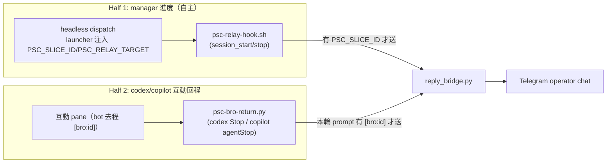

# #120 relay/hook → PaulShiaBro/Telegram 統一接線（design）

> 制定日期：2026-06-30 ｜ 對應 issue：#120（併 #89）｜ umbrella：#14
> 前置已就位：#117（三家 relay/Stop hook 已實證 fire）、#131（manager 自主派工 un-blind）
> v2（2026-06-30）：依 codex adversarial review 改 **turn-scoped binding** + 修正 codex assistant text 來源。

## 1. 背景與問題

「relay/hook 事件 → Telegram」這條**轉發端目前完全沒接**。兩個 producer 共用同一條 bridge：

1. **manager 進度**（原 #120）：`scripts/coordinator/psc-relay-hook.sh` 只把 `[manager] slice=X event=Y` 寫進 `PSC_RELAY_TARGET` 檔，**沒有任何東西把它推到 Telegram**。
2. **codex/copilot 互動回程**（原 #89）：去程（bot `route_to_agent` → `send-keys [bro:<id>] <msg>`）平台無關；但回程目前**只有 Claude** 有 `scripts/gemma4-hooks/bro_in.py` / `bro_out.py`。codex/copilot pane 的回覆回不到 Telegram。

兩者最終都收斂到 **`reply_bridge.py → Telegram`** 同一接線點。

## 2. 目標與非目標

**目標**
- manager 自主派工的 `session_start` / `stop` 進度推到 Telegram（broadcast 到已綁定 operator）。
- codex / copilot **互動** pane 的**本輪**回覆推回 Telegram，對齊 Claude 既有體驗。
- 沿用既有 `reply_bridge.py`（收件人解析、chunking、授權）與 importer transcript readers，不重造輪子。

**非目標**
- ❌ 動去程（bot→pane `route_to_agent`，平台無關、已可用）。
- ❌ capture-pane 末 N 行 fallback（issue checkbox 3，自標「視需要」）—— 先不做，留 follow-up。
- ❌ 改 Claude 既有 `bro_in`/`bro_out`（已可用）。
- ❌ 進度節流 / 去重（先求可見；吵了再加）。

## 3. 架構總覽



兩條 producer 都靠 **marker 區分**自己該不該送，因此 codex/copilot 的**同一個 Stop hook**會被 manager headless job 與互動 pane 各自觸發，但只有對應 marker 的那條會送、不會誤送或雙送：

| 觸發來源 | `PSC_SLICE_ID` 環境 | **本輪** prompt `[bro:id]` | Half 1 送？ | Half 2 送？ |
|---|---|---|---|---|
| manager headless 派工 | 有（launcher 注入） | 無 | ✅ 進度 | ❌ no-op |
| 互動 pane 本輪由 Telegram 路由 | 無 | 有 | ❌ no-op | ✅ 回覆給該 user |
| 互動 pane 本輪為本地輸入 | 無 | 無 | ❌ no-op | ❌ no-op |

## 4. Half 1 — manager 進度轉發

**改 `scripts/coordinator/psc-relay-hook.sh`**：寫檔後，**僅當 `PSC_SLICE_ID` 已設且非 `unknown`**（= 確為 manager 派工，launcher 注入），追加一筆 best-effort：

```sh
# 既有：寫 relay channel 檔（audit）
# 新增（gate 於 PSC_SLICE_ID）：推 Telegram，broadcast 到已綁定 operator
if [[ -n "${PSC_SLICE_ID:-}" && "${PSC_SLICE_ID}" != "unknown" ]]; then
  python3 "$REPLY_BRIDGE" --text "$msg" >/dev/null 2>&1 || true
fi
```

- **收件人**：不帶 `--source-user-id` → `reply_bridge` 既有邏輯 broadcast 到所有 `allowed_user_ids` 中有 chat binding 者（單人即 operator 本人）。
- **gate 理由**：`psc-relay-hook.sh` 已裝在使用者**全域** codex/claude config（`~/.codex/hooks.json` 等），對所有 session fire；不 gate 會讓每個互動 session 的 start/stop 灌爆 Telegram。互動 session 無 `PSC_SLICE_ID` → 天然 no-op。
- **REPLY_BRIDGE 路徑**：沿用 `bro_out.py` 同一常數 `~/.agents/skills/bro/scripts/reply_bridge.py`（部署後存在）；`reply_bridge` 為純 stdlib，plain `python3` 即可跑。缺檔時 `|| true` 靜默略過。
- **best-effort 契約不變**：relay hook 失敗 MUST NOT 影響 agent 執行或完成偵測。

## 5. Half 2 — codex/copilot 互動回程（turn-scoped）

**新增單一支 `scripts/gemma4-hooks/psc-bro-return.py`**（platform 參數化：`--platform codex|copilot`），裝進 codex `Stop` / copilot `agentStop`。

### 5.1 turn-scoped binding（核心修正）

去程 `route_to_agent` 對**每一則**經 Telegram 路由的訊息前綴 `[bro:<user_id>]`；codex `Stop` / copilot `agentStop` **每輪** fire 一次。故 recipient 必須**綁本輪**，不可綁 session 第一則：

- 取 transcript 的 **`user_prompts[-1]`（本輪 prompt）**，套 `^\s*\[bro:(\d+)\]`（與 `bro_in.py` 同 regex）。
- **有 marker** → 回覆送該 `user_id`；**無 marker** → no-op（本地輸入 / 非 bro 路由，含 manager headless job）。
- 等價於 Claude 的 per-`UserPromptSubmit` `bro_in` 狀態寫入——只是改在 Stop 當下從 transcript 自我發現本輪 user_id。
- 正確涵蓋 review 點名的三案：first-bro→then-local（no-op）、first-bro→then-different-user（送新 user）、first-local→then-bro（送 bro user）。

> 邊界假設：`extract_user_prompts` / `read_*` 只回 `role=='user'` 的真 prompt（tool 輸出非 user role），故 `[-1]` 即本輪使用者訊息。tool-turn 由測試涵蓋。

### 5.2 取本輪回覆（per-platform，修正 codex 來源）

- **copilot**（`agentStop`）：`read_copilot_history(config_root=$HOME, session_id)` 一次取回 `{user_prompts, assistant_summary}`——`user_prompts[-1]` 供 5.1 marker、`assistant_summary` 為本輪回覆（`base.py:201` 確實回 assistant 文字）。
- **codex**（`Stop`）：
  - **回覆**：來自 **Stop event payload 的 `last_assistant_message`**（codex payload 確帶；importer codex adapter 即以此為主來源）。
  - **user_prompts**：`read_codex_rollout(transcript_path)`（event 無 path 則掃最新 `~/.codex/sessions/**/rollout-*.jsonl`）——**僅用於 5.1 的 marker**。
  - ⚠️ **不**用 `read_codex_rollout → extract_assistant_summary` 取回覆：`read_codex_rollout`（`base.py:204-209`）明示**不讀 assistant**，那條 fallback 必回空 → 誤送 `EMPTY_NOTICE`。已移除。

### 5.3 EMPTY_NOTICE 語意（修正）

- 回覆**讀得到但為空字串** → 送 `EMPTY_NOTICE`（「已完成，無文字輸出」，真實的無輸出）。
- 回覆**讀不到**（codex 缺 `last_assistant_message` key / copilot history 缺檔或壞檔）→ `_log` 記錄並 **skip 不送**（不可拿 `EMPTY_NOTICE` 冒充「無輸出」）。

### 5.4 送出與安裝

- `reply_bridge.py --source-user-id <id> --text <reply>`（複用授權/chunking/binding）。
- reader 直接 import `paulshaclaw.memory.importer.adapters.base`；執行 python 沿用 memory hook 既有的 package-aware venv（`~/.agents/memory/hooks/.venv/bin/python`，與 `codex_session_end.py` 同源）。
- 以新 `managedBy: psc-bro-return` entry 併入 codex `Stop` / copilot `agentStop`（與既有 `psc-coordinator-relay`、`paulsha-memory` 並存，nested merge，保留他人 entry）。Claude 端不加。

## 6. 錯誤處理

- 兩條 producer 全程 best-effort：任何例外 → log 到 `~/.agents/log/bro-hook.log`，return 0，**絕不**破壞 agent。
- `reply_bridge` 失敗（未授權 / 無 binding / Telegram error）→ 自帶 nonzero exit + stderr；Half 2 沿用 `bro_out` 的 `_log("send", …)`，不靜默吞。
- 回覆讀不到 → skip + log（見 5.3），不送誤導訊息。
- transcript 未 flush：copilot 沿用 `bro_out` 短輪詢思路；codex 回覆來自 event payload 故通常免輪詢。

## 7. 測試策略

純函式 / 注入式，**不啟動真 agent、不打真 Telegram**（注入 fake sender / opener）：

- **Half 1**（`tests/test_coordinator_relay_hook.py` 擴充）：
  - `PSC_SLICE_ID` 設 → 呼叫 reply_bridge（stub 在 PATH，記 argv）。
  - `PSC_SLICE_ID` 未設 / =unknown → **不**呼叫（互動 session 不 spam）。
  - reply_bridge 缺檔 / 失敗 → hook 仍 exit 0。
- **Half 2 — turn-scoped binding**（新 `tests/test_psc_bro_return.py`，注入 user_prompts/assistant）：
  - first-bro→then-local：`["[bro:111] a", "local b"]` → **不送**。
  - first-bro→then-different-user：`["[bro:111] a", "[bro:222] b"]` → 送 **222**。
  - first-local→then-bro：`["local a", "[bro:111] b"]` → 送 **111**。
  - 無任何 marker（manager headless job）→ 不送。
- **Half 2 — 回覆來源**：
  - copilot happy：`read_copilot_history` 取回覆 → 送。
  - codex happy：payload `last_assistant_message` → 送。
  - **codex 缺 `last_assistant_message` key（但 rollout 有 assistant 內容）→ skip + log，不送 `EMPTY_NOTICE`**（直接針對 review medium 點）。
  - 回覆為空字串 → 送 `EMPTY_NOTICE`。
  - reader 例外 / sender 例外 → exit 0、log 有記。
- 既有 `test_coordinator_relay_hook.py` / `test_telegram_reply.py` / `test_gemma4_bro_hooks.py` 維持綠。

## 8. 交付邊界（單一 PR）

`feature/120-relay-hook-telegram`：
- `scripts/coordinator/psc-relay-hook.sh`（Half 1 gate + push）
- `scripts/gemma4-hooks/psc-bro-return.py`（Half 2 新檔，turn-scoped）
- 安裝/部署：codex `Stop` / copilot `agentStop` 註冊（hook 模板 + install 腳本）
- 測試：上述兩組
- docs：README / openspec spec 對齊（R-18）

> capture-pane fallback、進度節流 為明示 follow-up，不在本 PR。
