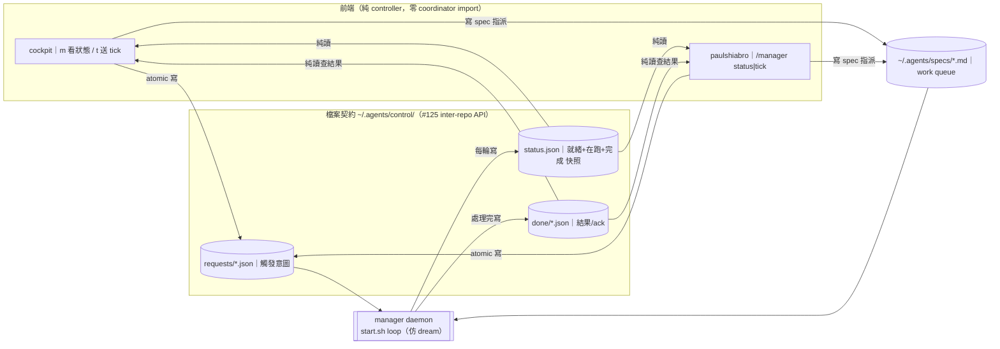

# Manager Control Plane — 設計（design spec）

- 日期：2026-07-03
- Issue：#187（單張全包）｜Umbrella：#14｜關聯：#125（repo 切包）、#126（常駐 systemd 化）、#23（舊 /dispatch）
- 階段：brainstorm 產出（依 `feature-delivery-pipeline`，停在 writing-plans）

## 1. 背景與問題

persona **manager**（`paulshaclaw.coordinator`）目前只有兩個驅動來源：CLI（`python -m paulshaclaw.coordinator tick|fanout|ready|jobs|stat`）與 systemd `--user` timer。兩個前端都還沒接：

- **cockpit**（`paulshaclaw/cockpit/app.py`）：`BINDINGS` 只有 pane swap（↑↓/Enter/`c`/`q`/`?`）。help modal 直接吃 `self.BINDINGS`，新增 `Binding` 即自動進 help。
- **paulshiabro**（`paulshaclaw/core/commands.json` + `daemon.py`）：現有 `/help /status /dispatch /tmate /agent`。`/dispatch` 走的是**舊 `coordinator.create_job`**（非 manager 的 specs→tick 流程，見 #23）。

關鍵環境事實：`scripts/start.sh` 的 `start_manager_service()` 在 **WSL 無 user systemd** 時 graceful skip，因此 manager 的 systemd timer 在本機實際上被跳過（`systemctl --user list-timers` 空）。反而 `start_dream_loop()`（背景 `while true; do sleep; <cmd>; done`，綁 start.sh 生命週期、idle-gated、有 toggle）是**已驗證能在本機常駐**的模式。

## 2. 目標與非目標

### 目標
1. 定義 manager 的 **檔案契約（control plane）**：`requests/` `done/` `status.json` + 既有 `specs/`——成為前端與 manager 之間、乃至 #125 切 repo 後的跨界 API。
2. 實作 **常駐 manager daemon**（start.sh loop，仿 dream）：排空 request、週期 idle-gated tick、每輪寫 status 快照。
3. **cockpit**：`m`（狀態面板）/ `t`（送 tick request）兩個 `Binding`，自動進 `?` help。
4. **paulshiabro**：`/manager [status|tick]`，照 `/tmate` 子動作模式。
5. **前端純 controller**：只讀 `status.json` / 原子寫 `requests/` / 查 `done/`，**完全不 import coordinator**（切 repo 免疫）。

### 非目標（留後續，明確排除）
- 從前端新增 slice（需帶 plan，薄前端笨重）→ 後續 issue。
- manager 真正 systemd 常駐化 → **#126**（本設計用 start.sh loop 過渡）。
- enforce 翻牌 / persona-scope required check → **#124**。
- 修既有 `/dispatch` 舊路 → **#23**。
- repo 實際切包 → **#125**（本設計只把「檔案契約」定義出來當前置）。

## 3. 架構總覽



**分層職責**：前端只懂「檔案契約」；daemon 懂「契約 ↔ coordinator 內部」；coordinator 內部（handoff/jobs/launcher）對前端不可見。前端因此對 coordinator 內部改版與 repo 切包免疫。

## 4. 元件一：檔案契約（control plane）

**Purpose：** 前端與 daemon（乃至跨 repo）之間唯一的溝通介面；canonical state 落檔、決策依檔案（artifact-first），為 #125 切 repo 提供穩定 API。

根目錄 `~/.agents/control/`，路徑集中定義於單一常數模組（呼應 #91 environment facade、路徑分散整理），不散落 `Path.home()`。

### 4.1 `requests/<req_id>.json`（前端寫，daemon 讀）
```json
{
  "schema_version": 1,
  "req_id": "20260703T101500Z-<uuid4>",
  "type": "tick",                         // tick | fanout
  "args": { "executor": "copilot", "allow_unsafe": false, "specs_dir": null },
  "requested_by": "cockpit",              // cockpit | telegram
  "created_at": "2026-07-03T10:15:00Z"
}
```
- 前端以 **temp 檔 + `os.rename`** 原子寫入（避免 daemon 讀到半寫檔）。
- `req_id` 由前端生成（timestamp + uuid4），供 `done/` 對位。

### 4.2 `done/<req_id>.json`（daemon 寫，前端查）
```json
{
  "schema_version": 1,
  "req_id": "...",
  "status": "ok",                          // ok | error
  "result": { "dispatched": [...], "polled": [...], "completed": [...] },  // tick summary
  "error": null,
  "started_at": "...", "finished_at": "..."
}
```

### 4.3 `status.json`（daemon 每輪 rollup，前端唯一觀測來源）
```json
{
  "schema_version": 1,
  "updated_at": "...",
  "daemon": { "pid": 12345, "last_tick_at": "...", "idle": true },
  "ready":      ["sl-foo", "sl-bar"],
  "in_flight":  [ { "job_id": "...", "slice_id": "sl-foo", "state": "running" } ],
  "recent_done":[ { "slice_id": "sl-baz", "gate_status": "passed", "at": "..." } ]
}
```
- 前端**只讀這一個檔**，不掃內部 `runtime/handoff` / `state/coordinator/jobs`；內部改版不影響前端。

### 4.4 並發與健壯性
- 單例 daemon lock（`control/lock` 或沿用 coordinator `lock/`）。
- request 處理採「讀 → 處理 → 寫 done → 刪/移 request」；重覆 req_id 以既存 done 為準（冪等）。
- 所有寫入 atomic（temp+rename）。`schema_version` 供 #125 契約演進。

## 5. 元件二：manager daemon

**Purpose：** 唯一擁有 orchestration 權威的常駐消費者；把 requests/specs 轉成實際 tick 與可觀測的 status，讓前端不需碰 coordinator 內部。

進入點：`paulshaclaw/coordinator/manager_daemon.py`（`run_loop(...)`；**刻意不叫 `daemon.py`** 以免和 paulshiabro 的 `core/daemon.py` 混淆）。復用既有 `autonomy.scan_specs/ready_units`、`manager.run_tick`、`JobRegistry`、`Dispatcher`——daemon 是「契約層的薄殼」，不重寫 orchestration。

**每輪迴圈**：
1. **drain requests**：列出 `requests/*.json`（時間排序）逐一處理 → 依 `type` 呼 `manager.run_tick` / `autonomy.dispatch_ready` → 寫 `done/<id>.json` → 移除該 request。單一 request 例外不中斷 loop（仿 dream `|| true`，寫 `done status=error`）。
2. **週期 tick**：距上次 tick ≥ `tick_interval`（預設 300s）→ 跑 idle-gated fanout tick（接手現行 timer 職責）。`--require-idle` 語意沿用（只擋 fanout）。
3. **寫 `status.json`** rollup（ready/in_flight/recent_done/daemon）。
4. `sleep poll_interval`（預設 3–5s，對 request 反應快；tick 仍以 300s 節流）。

**runtime 掛載**：`scripts/start.sh` 新增 `start_manager_loop()`，**仿 `start_dream_loop()`**——背景 subshell `while true`、toggle `PSC_MANAGER_DAEMON_DISABLED`、log `~/.agents/log/manager.log`、綁 start.sh `cleanup`。**取代** `start_manager_service()` 的 timer 掛載（timer 停用或保留為 #126 的 systemd 選項）。

**安全**（沿用 coordinator 既有守門）：
- headless 觸發需 `executor`（預設 `copilot`；Haiku model alias = `claude-haiku-4.5`）。
- `allow_unsafe` 預設 `false`；為 true 時沿用 `_refuse_unsafe_fanout` 的 **fail-closed ≤1 就緒 slice**。
- worktree 從 `main` 切 `feature/<slice_id>`。

## 6. 元件三：前端 controller（共用薄 helper）

**Purpose：** 純 controller——只碰契約、不碰 coordinator 邏輯，讓 UI 與 orchestration 徹底解耦（切 repo 免疫）。

新增 `paulshaclaw/control/client.py`（放在 cockpit 與 core 皆可 import、且**不依賴 coordinator** 的位置）：
- `read_status() -> dict`：讀 `status.json`；缺檔/過期 → 回 degraded（明確標記，不用舊值假裝——呼應「遙測勿用舊值掩蓋」）。
- `submit_request(type, args, requested_by) -> req_id`：atomic 寫 `requests/`。
- `poll_done(req_id, timeout) -> dict | None`：輪詢 `done/`。
- 路徑常數集中於此（或共用 paths 模組）。

### 6.1 cockpit（`app.py`）
- `Binding("m", "manager_panel", "m manager 狀態")` → `action_manager_panel` push 一個 `ManagerModal`（仿既有 `HelpModal`）顯示 `read_status()`。
- `Binding("t", "manager_tick", "t 踢 manager tick")` → `action_manager_tick` 呼 `submit_request("tick")`（**非阻塞**，不卡 Textual event loop）→ 之後刷新面板顯示 `done` 結果。
- 兩 Binding 自動出現在 `?` help modal（既有機制吃 `BINDINGS`）。

### 6.2 paulshiabro（`commands.json` + `daemon.py`）
- `commands.json` 新增 `/manager`（`usage: "/manager [status|tick]"`、`telegram_menu`）。
- `daemon.py` 新增 `_handle_manager_command`（照 `/tmate`/`/agent` 子動作）：
  - `status` → `read_status()` 摘要文字。
  - `tick` → `submit_request("tick")`，短輪詢 `done` 約 15s；有結果回 summary，逾時回「已排入，稍後 `/manager status` 查」。

## 7. 代表資料流：從 cockpit 踢一趟 tick

```
按 t → client.submit_request("tick")
     → 原子寫 ~/.agents/control/requests/<id>.json
daemon 下一輪 drain → manager.run_tick(...)（launch headless + poll 一趟）
     → 寫 done/<id>.json + 更新 status.json
cockpit 面板刷新讀 status.json / poll_done(<id>) → 顯示 dispatched/completed
```
非同步：前端送出即返回，不等 tick 完成；狀態之後從檔案浮現。

## 8. 錯誤處理

- daemon 單輪/單 request 失敗 → log + continue，不倒 loop；request 失敗寫 `done status=error, error=<reason>`。
- request schema 非法 → daemon 拒收並寫 error done。
- `status.json` 讀不到/過期 → 前端顯示 degraded（`--`），不沿用舊值。
- 前端 `submit_request` 失敗（control dir 不存在等）→ 明確錯誤訊息，不靜默。

## 9. 測試策略（交給 writing-plans 承接）

- **契約**：schema round-trip；atomic write（temp+rename）；兩前端並發 submit 不互蓋；degraded 讀取。
- **daemon**：注入 fake `Dispatcher`/`JobRegistry`（CLI `main()` 既有注入 seam 可沿用）——drain 一個 tick request → 寫對 `done` + `status`；週期 tick idle-gated；單 request 失敗不中斷 loop；lock 單例。
- **前端**：cockpit `action_manager_tick`/`action_manager_panel` 注入 fake client（不真派工）；`/manager` handler status/tick 兩分支注入 fake client；**help modal 含新 Binding**（本機 import+AST 驗、行為以 CI 為準——cockpit Textual 版本漂移教訓）。
- **回歸**：不動既有 `/dispatch`、cockpit pane swap。
- 驗證用 `~/.local/bin/pytest paulshaclaw/...`（memory：unittest discover 會漏 `def test(tmp_path)` 風格）。

## 10. 決策記錄（brainstorm 結論）

| 決策 | 選擇 | 理由 |
|---|---|---|
| 前端↔manager 呼叫方式 | **檔案契約**（非 import／非 subprocess） | 解耦、artifact-first、為 #125 切 repo 鋪路 |
| daemon runtime | **start.sh loop 仿 dream** | WSL 無 user systemd（timer 被 skip）；dream loop 已驗證可跑；systemd 版歸 #126 |
| 前端觀測來源 | **單一 status.json rollup** | 前端不碰內部目錄，內部改版/切 repo 免疫 |
| Telegram tick 回覆 | **送出後短輪詢 ~15s** | 有結果即回 summary，逾時回「已排入」 |
| tick 觸發模型 | **非阻塞 submit** | 不卡 TUI event loop / Telegram 30s timeout |
| issue 結構 | **單張 #187 全包** | 使用者指定 |

## 11. 相依與風險

- **WSL systemd**：故走 start.sh loop（已驗證）。
- **Textual 版本漂移**：cockpit 測試以 CI 為準；本機做 import/AST/inspect。
- **部署**：`start.sh` 是 entrypoint，改後需重啟 tmux 生效（運維：tmux 死＝全重啟）。
- **路徑集中**：control plane 路徑走單一常數，勿散落（#91）。
- **與 timer 過渡**：loop 上線後停用/忽略舊 manager timer，避免雙重 tick。
