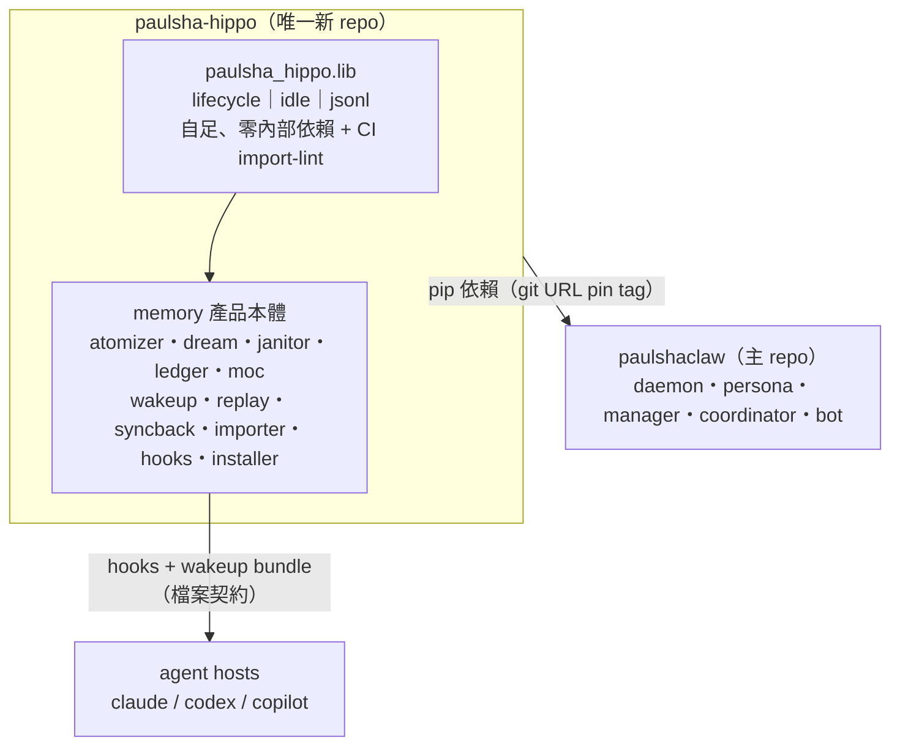
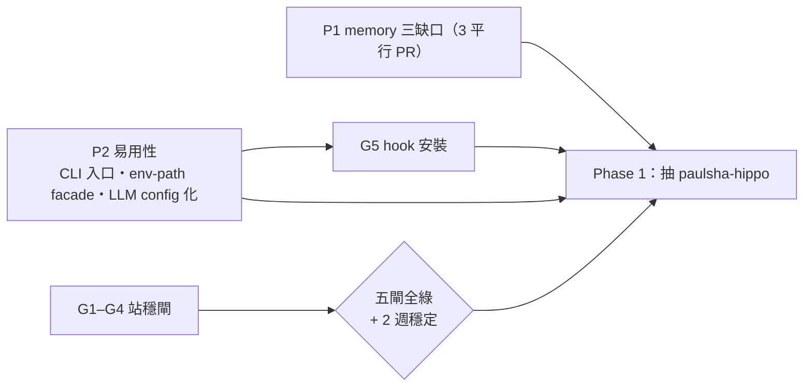

# memory 抽離（paulsha-hippo）設計 — #125 Phase 1 執行設計

> 日期：2026-07-06 ｜ 狀態：草案（已含 Codex 對抗審查四項修正：路徑契約、G3 fallback、daemon 解耦、SHA pin）
> 對應：#125（repo 切包）、#197（memory 運作評估）、#201（deident gate）
> 前置脈絡：`origin/feature/p0-p3-specs`（站穩閘 G1–G5 + P0–P3 specs，另機開發中）、`docs/superpowers/specs/2026-07-06-p3-standup-gates-umbrella-design.md`（分支上）
> **定位聲明**：本 spec 鎖定拆包的架構裁決、範圍、時序與驗收；不含 G1–G5 實作內容、不含 Phase 2 治理包拆分本體。**動工受 #125 站穩閘約束（五閘全綠 + 2 週穩定）；本設計可先行的部份見 §4。**

## 1. 目標

把 Stage 2 memory 子系統（`paulshaclaw/memory/**`，約 31k LOC、88% repo 佔比）抽成獨立 repo `hamanpaul/paulsha-hippo`，達成：

1. 使用者可單獨安裝（不裝 paulshaclaw），以 systemd user units 常駐。
2. 可設定 memory folder 與蒸餾 LLM：預設檔位 headless claude（零 key/oauth 管理），可切地端 LLM。
3. 共用件（lifecycle 等）lib 化，persona/manager 可復用。
4. 依 `hamanpaul/new-project-template` 建 repo，帶 paulsha-conventions 1.0.12。
5. README 重寫：安裝與使用最前，架構往下放。

## 2. 決策記錄（2026-07-06 brainstorm 已裁決）

| 決策點 | 裁決 | 理由摘要 |
|---|---|---|
| 命名 | `paulsha-hippo`（package `paulsha_hippo`，CLI `hippo`） | 海馬迴＝睡眠期記憶固化，與 dream service 隱喻同構；家族前綴一致；GitHub/PyPI 無撞名（2026-07-06 查證） |
| 抽離範圍 | `memory/**` 全部搬 | 邊界乾淨：memory 對外 import 僅 `paulshaclaw.lifecycle` |
| 主 repo 耦合 | pip 依賴（git URL **pin commit SHA**，PyPI 後續轉 version+hash） | 保留 persona/coordinator 兩處 lib import；daemon 解耦（§6）。SHA 不可變，tag 僅作人讀標記且設 protected（審查修正 #4） |
| 共用件出貨形式 | **先二後三**（對齊 #125）：`paulsha_hippo.lib` 自足子 package；Phase 2 治理包真要拆時再升獨立 `paulsha-lib` | 少一個 repo 的 conventions/CI/發版稅；子 package 自足使升格為純機械搬移。本裁決即傘狀 spec 要求的「動工前重新確認」 |
| lib 內容 | `lifecycle`（schema/gate/events/template）+ `idle` + `jsonl`；P2 facade 落地後路徑契約併入 | 三者皆有兩個以上跨 repo 使用者（盤點見 §3） |
| git 歷史 | 全新開始，無歷史 | 主 repo 舊分支污染歷史教訓；template 建 repo |
| 安裝通道 | GitHub 先行（`pipx install git+https://...`），PyPI 後續 | 免發版維運、保留升級路 |

## 3. 全景架構

### 3.1 拓撲（「先二」狀態）



### 3.2 依賴方向鐵律與 lib 入會規則

- `paulsha_hippo.lib` 不 import hippo 其他模組（CI import-lint 強制）；`paulsha-hippo` 不依賴 `paulshaclaw`；`paulshaclaw` 依賴 `paulsha-hippo`。絕不反向。
- lib 入會規則：兩個以上跨 repo 使用者、自足、盡量 stdlib-only。單一使用者的模組留在使用端。
- 共用件使用盤點（2026-07-06 grep 實測）：`lifecycle` ← memory(atomizer/syncback/tests) + persona.contract；`idle` ← memory.dream + coordinator.manager；`jsonl`（append-only + flock 原語） ← memory.ledger ×5 檔 + coordinator.manager_daemon（現為重複實作，lib 化即去重）。
- `memory.policy` 僅 memory 內部使用 → 留 hippo 本體，不入 lib。

## 4. 時序與 feature/p0-p3-specs 分支協調



- **現在可先行（不搬 code）**：本設計定稿；hippo repo 骨架（template 建 repo、CI 四道、deident gate、README 草稿）。
- **搬 code 硬前置**：`p1-memory-three-gaps`（改 build_index/janitor ledger/llm_output/atomizer prompt——全在搬遷範圍）、`g5-hook-install`（hooks 冪等安裝 + `--verify`，成果原封入 hippo installer）、`p2-usability-phase0`（facade 與 LLM backend config 化是 §6 config 設計的地基）落地，避免 move-vs-modify。
- **雙機協調**：對 main 只加新檔案；#125 工作名 `paulsha-memory`→`paulsha-hippo` 以 issue comment 註記，分支 merge 後再做 docs 對齊，不搶另一機正在寫的檔。
- **G3 協調點**：dream 的 systemd unit 範本保持可分離，拆分時由 hippo installer 繼承。

## 5. paulsha-hippo 內部設計

### 5.1 Package 結構

```
paulsha_hippo/
├── lib/                    # lifecycle｜idle｜jsonl（§3.2）
├── atomizer/ dream/ janitor/ ledger/ moc/ wakeup/
│   replay/ syncback/ importer/ lint/ policy/ skillopt/ …   # 照現行 memory/** 平移
├── hooks/                  # claude/codex/copilot session hooks（隨包出貨）
├── paths.py                # 路徑契約（承接 P2 facade 的 hippo 端）★新
├── config.py               # 單一 config 載入 + env 覆寫 ★新
├── install/                # hooks + systemd installer（吸收 g5 成果）★新
└── cli.py                  # hippo 命令樹
```

### 5.2 CLI（entry point `hippo`，去掉現行 `memory` 前綴層）

```
hippo init                        # 互動式：memory root、LLM backend、agent host
hippo atomize / dream run|status / janitor scan / replay / bundle
hippo search / wakeup / syncback check / knowledge prune-noise
hippo install hooks --host claude|codex|copilot|all    # 冪等（g5 語意）
hippo install service [--enable]  # systemd 偵測 + fallback，見 §5.5
hippo dream supervise             # 非 systemd 主機的常駐前景模式
hippo doctor                      # g5 --verify 健檢：hooks/units/config/backend 連通
```

### 5.3 Config：單一檔 + env 覆寫（對齊 #125 Phase 1 DoD）

```yaml
# ~/.config/paulsha-hippo/config.yaml
memory_root: ~/.agents/memory        # 可設定；預設維持 path-split 契約 → 主 repo 使用者零資料遷移
distiller:
  backend: claude-headless           # 預設檔位
  timeout: 600
schedule:
  dream: "Mon..Fri 05:00"
  require_idle: true
```

- 密鑰一律 `~/.config/paulsha-hippo/secret.env`（0600）；config.yaml 只放 env var 名引用，永不放值。
- env 覆寫通則：所有 config 鍵可用 `HIPPO_*` 前綴覆寫（如 `HIPPO_MEMORY_ROOT`）。

**路徑契約：單一權威 resolver（審查修正 #1，防 split-brain）**

- hooks 現況全面讀 `PSC_MEMORY_ROOT`（2026-07-06 grep 實測：claude/codex/copilot hooks + `_wakeup_common.py`），且 P2/G5 以 `PSC_*` 為 facade 契約。若 hippo 只讀自己的 config，會出現 hooks 寫 A 根、dream 讀 B 根的靜默分家。
- 對策：`paulsha_hippo.paths` 是**唯一**的 memory root resolver，所有表面（CLI、hooks、systemd/supervisor 服務）一律經它解析，優先序**明文固定**：
  `--memory-root CLI 旗標 > HIPPO_MEMORY_ROOT > PSC_MEMORY_ROOT（deprecated，讀到即 stderr 警告）> config.yaml memory_root > 預設 ~/.agents/memory`
- `hippo doctor` 檢查：`PSC_MEMORY_ROOT` 與 `HIPPO_MEMORY_ROOT`／config 同時存在且指向不同路徑 → **FAIL**（非警告），並列出各表面實際解析結果。
- 測試要求：G5 時代以 `PSC_*` 安裝的舊 hooks 在拆分後仍寫入同一 root（相容回歸測試）。

### 5.4 蒸餾 LLM backend 三檔位

| 檔位 | 行為 | 適用 |
|---|---|---|
| `claude-headless`（預設） | 跑 PATH 上的 `claude -p`，吃使用者現有登入；零 key/oauth 管理 | 開箱即用 |
| `openai-compatible` | `base_url` + `model` + `api_key_env`，內建 stdlib HTTP caller（不再需要 claude-gemma4 proxy 層） | ollama / vLLM / LM Studio / 內網 gemma |
| `custom-argv` | 任意 command argv，完整保留現行 `agent_exec` 機制 | codex exec、copilot CLI、既有 wrapper |

`claude-headless` 實作上是 `custom-argv` 的 preset；`openai-compatible` 走新 http-runner。runner 介面統一（prompt in、text out、timeout/token 上限），對 atomizer/promoter 透明。建立在 P2「LLM backend config 化」之上，不重造。

### 5.5 常駐服務：沿 G3 決策樹，systemd 為主、supervisor 為備（審查修正 #2）

G3 的裁決是「先驗證再選路」，且現行 `scripts/start.sh:214` 有 while-loop dream supervisor 直呼 `python -m paulshaclaw.memory.cli`——拆分後非 systemd 主機不能沒有替代路。

- `hippo install service`：先偵測（`systemctl --user is-system-running` 等價檢查）——
  - **systemd 可用** → 產 user units（`paulsha-hippo-dream.service/.timer`，沿現行範本 + g3 成果），`--enable` 執行 `systemctl --user enable --now` 並提醒 `loginctl enable-linger`。
  - **不可用** → 指引 supervisor 模式：新增 `hippo dream supervise`（前景常駐、interval + require-idle 語意與 start.sh 現行迴圈等價），可被任何 supervisor（start.sh、runit、cron @reboot）調用。
- **cutover / 回滾**：主 repo `start.sh` 的 dream 段在拆分 PR 改為呼叫 `hippo dream supervise`（PATH 檢測，未安裝則跳過並警告）；回滾 = 還原 start.sh 該段 + pip 移除 hippo。
- `hippo doctor` 驗 unit／supervisor 存活狀態。
- 測試要求：systemd-unavailable 環境（fake `$HOME`、無 user bus）下 `install service` 走 fallback 路徑且 `dream supervise` 可啟動。

### 5.6 Quickstart（15 分鐘，#125 DoD；README 第一節）

```bash
pipx install git+https://github.com/hamanpaul/paulsha-hippo
hippo init
hippo install hooks --host claude && hippo install service --enable
hippo dream run --dry-run
hippo wakeup
```

## 6. 主 repo（paulshaclaw）遷移

| 項目 | 處置 |
|---|---|
| `paulshaclaw/memory/**`、`paulshaclaw/lifecycle/**` | 刪除；pyproject 加 `paulsha-hippo @ git+https://...@<commit-sha>`（SHA pin，見 §2） |
| `persona/contract.py` | import 改 `paulsha_hippo.lib.lifecycle` |
| `coordinator/manager.py` | import 改 `paulsha_hippo.lib.idle` |
| `core/daemon.py` | **解耦（審查修正 #3）**：不再 import atomizer config。現行 `resolve_command_argv` 以 `PROJECT_ROOT`（package parents[3]）解析相對路徑，裝成套件後即 site-packages，`scripts/claude-gemma4` 必解析失敗。`/agent start` 的 agent argv 改為主 repo 自有 config 區段（daemon config + P2 facade），wrapper 路徑遷移時明確改寫為絕對路徑 |
| `scripts/start.sh` dream 段 | 改呼叫 `hippo dream supervise`（PATH 檢測，未裝則跳過+警告），cutover/回滾見 §5.5 |
| `openspec/specs/stage2-*`（12 capabilities） | 隨 code 搬入 hippo openspec |
| `scripts/claude-gemma4` + settings 範本 | 搬 hippo `examples/`，降級為 `custom-argv` 範例 |
| deploy planner 的 dream unit | 移交 hippo installer |
| `psc` CLI memory 子樹 | 移除，錯誤訊息指引 `hippo`，避免雙入口 |
| `~/.agents/memory` runtime 資料 | 零遷移（預設 memory_root 同位置，path-split 契約不變） |
| CLAUDE.md / README / docs | stage 2 章節改指向 hippo（R-18 同 PR 處理） |

## 7. hippo README 結構（zh-tw）

1. 一句話定位（跨 LLM vendor 的經驗筆記基座）＋ demo GIF 位 → 2. Quickstart（§5.6） → 3. 安裝細節（pipx、hooks per host、systemd、WSL enable-linger） → 4. 設定（config 全欄位、LLM 三檔位、secret.env 規則） → 5. 日常使用（dream/wakeup/search/replay/bundle） → 6. 架構（pipeline 圖 + `lib/` 說明） → 7. 家族關係與誠實狀態表。

## 8. 測試與 CI 歸屬

- **hippo**：87 個 memory test 檔隨包搬；CI 四道保證——tests（R-19）、policy-check（1.0.12、R-20）、lib import-lint、deident gate（#201，day-1）。實作映射（2026-07-06 p0-p3 merge 後定案）：import-lint 以 pytest 併入 tests；deident 以 conventions **R-21（`tier: shareable`）**併入 policy-check（P0-1「上游為正主」，markers 基線在引擎內）——實體 workflow 為兩道。
- **主 repo**：跨包 consumer tests 留守（#125 建議）；合併後 unit/integration 全綠才算完（integration_test_gate）。**必備 consumer tests（審查修正）**：(a) hippo installed 且 `paulshaclaw.memory` 不存在時 `/agent start/status` 綠；(b) 舊 `PSC_*` hooks 與 hippo 服務解析到同一 memory root；(c) systemd-unavailable 環境 fallback 路徑可用。

## 9. 風險與對策

1. **move-vs-modify**：p1/g5/p2 落地前不搬 code（§4 時序）。
2. **雙機協調**：main 只加新檔；#125 更名走 issue comment。
3. **字串級隱藏耦合**：抽離 PR 全 repo grep `paulshaclaw.memory`（hooks/units/docs 硬編碼）清零。
4. **deident（R-21/#201）**：memory code 含個人路徑假設，公開前 sanitize、gate day-1。
5. **發版鎖鏈與供應鏈（審查修正 #4）**：主 repo pin commit SHA（不可變）；tag 僅人讀標記且 repo 設 protected tags；CI 驗證從 pinned SHA 可重現安裝（GitHub 不可達時 CI cache/retry）；PyPI 上線後轉 version pin + hash。
6. **R-22 懸空引用**：主 repo docs 的 memory 引用於拆離 PR 同步清理。
7. **secret 遷移**：hippo 用自己的 secret.env，提供遷移指引、不自動搬密鑰。

錯誤處理原則：config 缺失 → 指引 `hippo init`；backend 不通 → `hippo doctor`；syncback/policy 維持 fail-closed。

## 10. 非目標

- G1–G5 實作內容（各自子 spec）。
- Phase 2 治理包（persona+coordinator+control）拆分本體——站穩後再評，可能終態是留主 repo。
- PyPI 發版流程細節（trusted publisher 等，後續升級時另定）。
- lifecycle schema 本身的功能演進。
