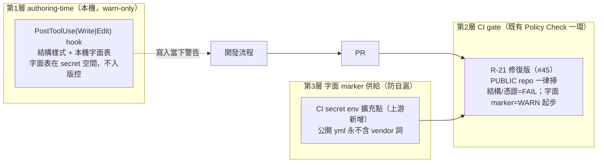

# P0 — 公開 repo 去識別化：止血 + 長效防洩機制 設計

> 日期：2026-07-06 ｜ 狀態：草案（待覆審）｜ 分支：`feature/p0-p3-specs`（spec）；實作分支另開
> 對應：本 repo #201（逐檔清單、兩段式範圍）＋ 上游 paulsha-conventions #45（R-21 threat-model 缺口）
> 稽核來源：2026-07-06 對抗性健檢報告（本機 notes，不入版控）

## 1. 背景與問題

repo 已 PUBLIC，但 tracked 檔案殘留去識別化資訊（**21 命中 / 12 檔**，逐檔清單見 #201；本 spec 依 de-ident 原則不重列字面值）。三類：內網 git host FQDN（最高）、雇主/供應商名、個人工作樹目錄名。

根因是**工程紀錄自漏**：2026-07 記憶 rekey/去噪工作「把 slice 從舊 raw-remote key 搬到乾淨 slug」，描述這次遷移的 plan / openspec / 測試把舊 key 與供應商名當範例寫進 repo。記憶內容本體（`~/.agents/memory`，repo 外）不受影響。

**機制缺口（上游 #45 定性）**：policy engine 的 R-21 機密掃描只 gate 自宣告 `tier: shareable`，`tier != shareable`（含未宣告，本 repo 即此況）直接回綠燈 PASS、不看 GitHub 實際 visibility——「最該掃的 repo（公開）」以綠燈形式逃逸。本 repo 的 Policy Check 從未對此掃描過任何內容。

## 2. 目標與非目標

**目標**
1. Stage A 止血：working tree 21 處換中性佔位，2 處硬編碼改 env 供給。
2. 長效機制：修上游 R-21（#45）為常備 gate——**藏在既有 Policy Check 裡，不加新 CI job、不改開發流程**。
3. 防清單自漏：字面 marker 永不落任何公開 tracked 檔。
4. authoring-time 第二層：本機 warn-only hook，在寫入當下攔截。

**非目標**
- Stage B（`git filter-repo` 歷史改寫）：另案，需 repo owner 明確授權（force-push、破壞既有 clone/PR ref）。
- 憑證掃描整合 gitleaks/trufflehog：上游 #45 建議項 3，本 workstream 不擋、留待後續引擎版本。
- 他 repo（如 testpilot-core）的內容清理：上游 #45 自帶案例，不在本 spec 範圍。

## 3. 架構：三層防禦

分層原則：**結構型 pattern 承擔 FAIL 權重**（`/home/<user>/` 絕對路徑、私鑰塊、內網樣式 FQDN、憑證樣式）——不含任何字面禁詞、可安全公開 commit；**字面 marker**（vendor/雇主詞）只做 WARN 起步且**只經 secret 通道供給**。

## 4. 工作序（鏡像上游 #45 的 codex 安全排序）

| 步 | repo | 內容 | 為什麼是這個順序 |
|---|---|---|---|
| 1 | paulsha-conventions | 修 #45：visibility 綁定（PUBLIC 一律掃、tier 只能豁免 private）、嚴重度分層、**marker env 擴充點**（`resolve_markers` 疊加 `PSC_SECRET_SCAN_EXTRA_MARKERS` 之類 env 來源）、**輸出遮蔽**（命中值不印進 CI log）→ release 下一版 | 先有安全的掃描器，才能開掃 |
| 2 | paulshaclaw | 以目標引擎版本**本機 dry-run**（升版 SOP：本機零 fail 才推送）——此即 #201 的驗收掃描 | 先私下盤點，避免把機密清單印進公開 CI log |
| 3 | paulshaclaw | Stage A 清理：#201 清單 12 檔換中性佔位（`vendor-a` / `git.example.com` / `prj_ext`）；`memory/instruction_corpus.py` 與 `scripts/start.sh` 的第 2 corpus root 改 env 供給（= #91 facade 頭期款，佔位 env 名 `PSC_EXTRA_CORPUS_ROOT`） | 清完才能綠 |
| 4 | paulshaclaw | policy-check.yml pin bump 到修復版引擎（uses 與 policy_engine_ref 同 SHA）→ gate 對本 repo 自動生效（PUBLIC 即掃，毋須宣告 tier） | gate 上線 |
| 5 | paulshaclaw | authoring hook：PostToolUse(Write|Edit) warn-only，讀 `~/.config/paulshaclaw/deident-markers.txt`（secret 空間，不存在則僅跑結構樣式）＋結構 regex；沿用既有 hooks 接線/install 模式 | 第二層，左移到寫入當下 |

依賴：步 1 → 步 2 → 步 3 → 步 4；步 5 獨立可平行。步 3 完成前**不得**宣告 tier 或以任何形式先開字面掃描輸出。

## 5. 錯誤處理與退化行為

- 引擎 env 擴充點未設定（secret 缺席）→ 字面 marker 層靜默縮為 baseline；結構/憑證層不受影響（恆開）。
- authoring hook 讀不到本機字面表 → 降級為結構樣式 only，不阻塞寫入（warn-only 永不擋）。
- pin bump 後若上游規則誤報 → 依既有 policy-exempt 慣例處理不了（R-21 對 public 無豁免 label 設計）——**逃生門 = revert pin**，並回 #45 補 fixture。

## 6. 測試與驗收

**上游（隨 #45 驗收）**：fixture `public + tier:work + 植入結構樣式` → FAIL；`private + tier:work` 同樣內容 → WARN 不擋；命中輸出遮蔽（log 無字面值）。

**本 repo**：
- [ ] dry-run（步 2）盤點結果 == #201 清單（不多不少；多出 = #201 漏列要補）。
- [ ] Stage A 後：`git grep`（tracked、排除 `ref/` 與宣告過的 fixture）結構/字面命中 = 0。
- [ ] 既有測試全綠（fixture 改名後）；`tests/` 對 2 處 env 化的行為測試（env 未設 → 預設不含第 2 root；env 設 → 生效）。
- [ ] pin bump 後 Policy Check 綠、且 R-21 對本 repo 實際執行（非 PASS-not-applicable）。
- [ ] hook：對含結構樣式的寫入發 warn 且不阻塞；字面表缺席不報錯。

## 7. 風險與既知坑

- **清單自漏**是本設計的第一級風險：任何字面禁詞不得出現在——本 spec、#201/#45 issue 內文、commit message、CI log、公開 yml。已全面以類別代稱。
- 步驟順序錯誤（先開掃描後清理）會把機密盤點印進公開 CI log——上游 #45 已警告，工作序表為此而排。
- Stage A 只擋 HEAD；歷史仍含字面值 → Stage B 另案（#201 已載明）。
- pin bump 前後引擎行為差異：照升版 SOP 本機實跑目標版本，勿信舊版綠燈。
