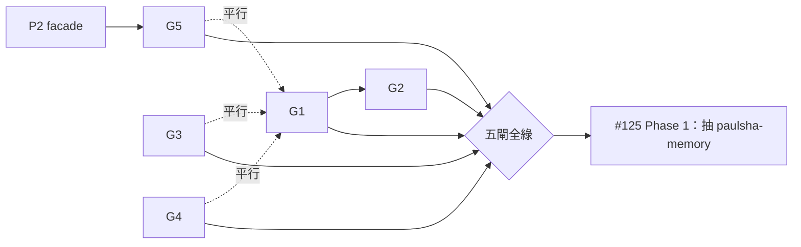

# P3 — persona/manager 站穩閘（G1–G5）傘狀設計

> 日期：2026-07-06 ｜ 狀態：草案（待覆審）｜ 對應：#125「站穩閘」、#14 #124 #126 #128 #132
> **定位聲明（誠實範圍）**：本 spec 只鎖各閘的**方向裁決 + DoD + 時序**；G1、G3 規模較大，動工時各出實作級細 spec。G2/G4/G5 可依本 spec 直接出 plan。五閘全綠 = 觸發 #125 Phase 1（抽 paulsha-memory）。

## 1. 背景

#125 拆包的前置條件是「persona/manager 站穩」。2026-07-06 review 把「站穩」定義為五個可驗收閘（G1–G5）。現況：manager 控制面（#191）剛通電；coordinator 真 adapter 未接（bot `/dispatch` 仍 fail-closed 於 UnavailableCoordinator）；persona 100% shadow。

## 2. 各閘方向裁決與 DoD

### G1（#14）coordinator 真 adapter —— 規模 L，動工時出細 spec
- **裁決：filesystem-queue adapter**。理由：對齊 #191 manager 檔案契約（`~/.agents/control/` 檔案協定 + 常駐 daemon）與 repo 運作模型（artifact-first / event-first：canonical state 落檔案與 event log）；CLI-command adapter 降為 fallback 選項，tmux 類 adapter 不採（seams 已刻意把 tmux 隔在 Protocol 後）。
- 契約要點（細 spec 展開）：`coordinator.backend` config 欄位（未設 → 維持 UnavailableCoordinator fail-closed）；job 檔 schema 帶版本欄；狀態遷移落 events.jsonl。
- **DoD**：Telegram `/dispatch` → 真 job id + events.jsonl 記錄 + worktree 建立的 e2e 測試綠；`LocalCoordinator` stub 標記 test-only。

### G2（#124）persona enforce 翻牌 —— 規模 M
- **裁決：分批 rollout**。`scope_ci` 加 `--enforce`，讀 `personas.yaml` per-persona `enforcement` 欄位；先翻 1 個 persona（建議 builder 類，write_paths 最明確）試點 ≥1 週，無誤傷再全開；`persona-scope` workflow 設 branch protection required check。
- **DoD**：越界 write_paths 的 PR 被 persona-scope 擋下（exit≠0）；試點期誤傷率記錄在案。

### G3（#126）常駐服務治理 —— 規模 M，動工時出細 spec
- **裁決：先驗證再選路**。第一個 task = 在目標 WSL distro 跑 `systemctl is-system-running` 定案 systemd 可用性（近期本機 `hostnamectl` 可用，與舊認知「WSL 無 systemd」矛盾——以實測為準）：
  - **可用** → 走 systemd `--user` units：deploy 平面**已有** templates（`deploy/templates/core/systemd/*.tmpl`）與 2026-06-22 manager daemon spec 的先例，非新基礎建設。
  - **不可用** → start.sh supervisor 加固（respawn/backoff/健康檔），並與 #195 孤兒修復合併處理。
- **DoD**：三常駐（dream / cost / manager）+ bot 開機自起、崩潰自復；`adr-001-always-on-deployment` 補寫（記錄實測結果與選路依據）。

### G4（#132）complete_tick idempotency —— 規模 M
- **裁決**：manifest idempotency key 由 `slice_id` 擴為 `(slice_id, run_id)`（或等價 merge 語意——同 slice 新 run 覆寫舊結果，非被舊結果卡住）；retry/requeue 場景明確定義覆寫規則。
- **DoD**：重複 `complete_tick` 同 slice 不產生重複 manifest；requeue 後新結果可落地（回歸測試涵蓋）。

### G5（#128）hook 安裝自動化 —— 規模 M，**依賴 P2 facade**
- **裁決**：hook 安裝統一併入 `install.sh` 單命令冪等（含三家 agent reconcile）；hook 內 abspath 全改 `${PSC_REPO_ROOT}`／facade 供給，消除部署複製後的路徑漂移。
- **DoD**：乾淨環境（假 `$HOME`）一鍵安裝→hooks 就位且 import 健檢綠；重複執行冪等；abspath 硬編碼 grep = 0。

## 3. 時序與依賴

- 主線 G1→G2（enforce 要有真 dispatch 流量才有意義的試點資料）。
- G3/G4/G5 互相獨立、與 G1 平行；G5 等 P2 PR-B facade。
- **G3 連續運轉驗收**（≥2 週無人工介入）與其他閘重疊計時，不串行等待。

## 4. 驗收（傘狀層）

- [ ] 五閘各自 DoD 條目關閉（對應 issue #14/#124/#126/#132/#128 CLOSED）。
- [ ] 站穩觀察期：manager_daemon + bot 連續 ≥2 週無人工介入（以 events.jsonl / log 佐證）。
- [ ] 觸發 #125 Phase 1 前重新確認：拆包仍以 paulsha-memory 為第一刀、lifecycle「先二後三」。

## 5. 非目標

- 各閘實作細節（G1 job schema、G3 unit 檔內容）——動工時細 spec。
- #125 Phase 1 本體（拆包執行）——另一個 workstream。
- 治理平面（persona+coordinator+control）是否獨立拆包——#125 Phase 2 議題，站穩後再評。
