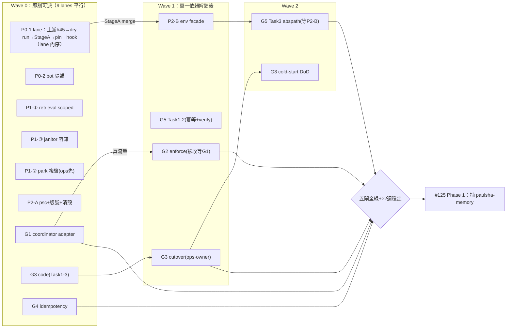

# P0–P3 最大平行 implement 派工 DAG（gpt5.3-codex，各自 worktree）

> 日期：2026-07-06 ｜ 狀態：**待派工**（owner 說 go 才動）｜ 9 份 plan 全數就緒（`docs/superpowers/plans/2026-07-06-*.md`）
> 原則：每 lane 一 worker 一 worktree（共用 checkout race 為既知坑）；lane 內序照各 plan；lane 間依此 DAG。**merge 一律走 PR、owner 核**（不自行 merge 慣例）。

## 1. 依賴邊（全部）

硬依賴（merge/驗收層級）：
- `P0-1 StageA`（env 化落 main）→ **P2-B**（facade 收編過渡 env）
- `P2-B`（facade merge）→ **G5 Task3**（Python hooks 走 facade；G5 Task1/2 不等）
- `G1`（真 dispatch 流量）→ **G2 驗收**（試點誤傷資料；G2 code 可先行開發）
- `P0-1 上游 U`（conventions #45 修復＋release）→ `P0-1 dry-run→StageA→pin bump`（lane 內序）
- `G3 code`（Task1–3）→ `G3 cutover`（**on-host ops、owner 在場**）→ G3 cold-start DoD

軟關聯（非阻塞、收斂註記）：
- `G3 bot cutover` 之後 → P0-2 的 start.sh respawn 降級 dev-mode only（G3 plan 內含）
- `G4` 的不變量防線由 `G1 already-active` 補完（G4 先 merge 亦安全——自動路徑既有過濾）
- `P1-①` rebuild 後觀察 offer 品質一週（#182 排序層承接）

## 2. 波次（wave）＝最大平行度

## 3. 派工表（owner 說 go 時照抄）

| Lane | plan | 分支（plan 內預定） | 波次 | 特別注意 |
|---|---|---|---|---|
| P0-1 | `p0-deident-mechanism.md` | 上游修復於 conventions repo＋本 repo Stage A 分支 | W0 | **de-ident 紅線全程**；Task1-2 在上游 repo；dry-run 輸出不得貼公開面 |
| P0-2 | `p0-bot-exception-isolation.md` | `feature/196-bot-exception-isolation` | W0 | respawn 測試避開 SIGKILL（#195 坑） |
| P1-① | `p1-memory-three-gaps.md` Task1 | `feature/197-retrieval-scoped-corpus` | W0 | rebuild 是交付步驟；exclude_rate WARN 必驗 |
| P1-③ | 同上 Task2 | `feature/197-janitor-ledger-tolerance` | W0 | ops 清壞行先備份 |
| P1-② | 同上 Task3 | `feature/197-park-floor-reverify` | W0 | **ops 先行**；禁手動 dream run |
| P2-A | `p2-usability-phase0.md` Task1-2 | `feature/125-psc-entry-version` | W0 | tag 由 owner 打 |
| G1 | `g1-coordinator-adapter.md` | `feature/14-g1-coordinator-adapter` | W0 | 最大件，**先派**；審查修正版語意（hold fail-closed＋already-active） |
| G3 | `g3-systemd-services.md` Task1-3 | `feature/126-g3-systemd-services` | W0 | Task4 cutover 須 owner 在場，worker 停在 Task3 |
| G4 | `g4-complete-tick-idempotency.md` | `feature/132-g4-complete-tick-idempotency` | W0 | 小件快贏 |
| P2-B | `p2-usability-phase0.md` Task3-4 | `feature/91-env-facade` | W1（等 P0-1 StageA） | 29 處機械遷移勿順手重構 |
| G2 | `g2-persona-enforce.md` | `feature/124-g2-persona-enforce` | W1（code 可 W0 尾；驗收等 G1） | 繞過面關閉語意（PR-bound＋governed fail-closed） |
| G5 | `g5-hook-install.md` | `feature/128-g5-hook-install` | Task1-2＝W1；Task3＝W2（等 P2-B） | verify 不印 env 值 |

**容量建議**：若一次只開 N<9 workers，優先序＝P0-1、P0-2（止血）→ G1（最長鏈頭）→ P1-①（功能紅利）→ 其餘小件（P1-③/G4/P2-A）填滿。

## 4. 完成定義

- 各 lane：plan self-review 條款＋openspec tasks 勾滿＋CI 綠＋PR（不自行 merge）。
- 全局：五閘 DoD ＋ ≥2 週穩定觀察 → 觸發 `#125 Phase 1`。
